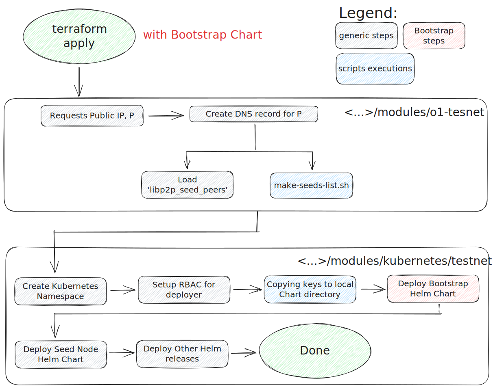

# Bootstrap Chart

## Motivation
**Unified management for environment requirements:** current deployment strategy does not provide a standard pre-deployment configuration mechanism for the destination Kubernetes environment, creating configuration divergence and security risks (e.g., **integration tests** [create key secrets](../../automation/terraform/modules/o1-integration/secrets.tf) directly from Terraform variables whereas **testnet deployment** relies on [bash scripts](../../automation/scripts/upload-keys-k8s-simplified.sh), etc.). 

**We need to define unified bootstrap procedure for Kubernetes infrastructure** that considers best practices for Secrets Management and Operations.

## Overview
`bootstrap` is an in-house dependency management module for the deployment of Mina Networks using [Terraform Kubernetes Testnet modules](../../automation/terraform/modules/kubernetes/testnet/).

By its own, `bootstrap` will:
- Create `$NAME-key` (i.e., seed keys) from files matching `./keys/*.pub`
- Create `$NAME-key` from files matching `./keys/libp2p-keys/` (i.e., libp2p keys)
- Create `gcloud-keyfile` from `./keys/gcloud-keyfile.json` (i.e., gcloud key file)

## Examples
Some examples are provided as a minimal test set.

### Generate dummy keys
Check the produced manifest using the `dummy-example.yaml` for rendering the Chart:

```bash
helm template . -f dummy-example.yaml
```

### Testnet deployments with `bootstrap` Chart included
