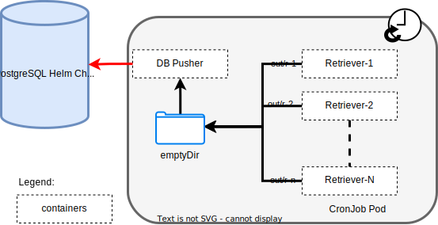

<a href="https://minaprotocol.com">
	
</a>
<hr/>

<br />

# CI Metrics Dashboard (PoC)

<br />

- [CI Metrics Dashboard (PoC)](#ci-metrics-dashboard-poc)
  - [Dashboard Architecture](#dashboard-architecture)
    - [Important assumptions to consider before adding a retriever](#important-assumptions-to-consider-before-adding-a-retriever)
    - [Default env variables propagated to retrievers](#default-env-variables-propagated-to-retrievers)
  - [Helm Chart Installation](#helm-chart-installation)
  - [Proposed development workflow](#proposed-development-workflow)
- [Future (ongoing) Work](#future-ongoing-work)

<br />

---

## Dashboard Architecture

<br />



The CI Metrics dashboard PoC Chart essentially deploys an auxiliary database, consequently populated by a collection of `retrievers` containers periodically executed by a Kubernetes CronJob. The database serves as a "data source" to Grafana.

Overall, the Chart deploys the following Kubernetes workloads:
- **(TBD)** A PostgreSQL from a [dependency Chart](https://github.com/bitnami/charts/tree/main/bitnami/postgresql). This deploy a StatefulSet and other resources. Refer to the repository for the configuration parameters.
- A CronJob with as many containers as configured `.Values.retrievers`.

Retrievers are a collection of Python scripts with a `requirements.txt` file and a main *script file*. Each script is mapped to a `retriever`, which is its container. The schema of a `retriever` in a `values.yaml` is the following:

```yaml
#####################################
# Proposed YAML schema for retrievers
#####################################
retrievers:
- name: "myRetriever" # must be unique among retrievers
  image: # retriever container image
    name: "python"
    tag: "latest"
  env: # to be inserted into .spec.container.*.env
    - name: MY_EXAMPLE_ENV
      value: MY_EXAMPLE_VALUE
  script: # python script to be executed by the retriever
    name: "example.py"
    secret: # Automatically created Secret with script.name contents
      name: "my-retriever-script"
    mountPath: "/mnt/my-scripts" # mountPath inside retriever container
```

### Important assumptions to consider before adding a retriever
- Script `SCRIPT_NAME` and `requirements.txt` file for retriever `RETRIEVER_NAME` should be placed under `files/$RETRIEVER_NAME` directory. Mandatory files:
  - `files/$RETRIEVER_NAME/requirements.txt`: details Python dependencies modules and versions.
  - `files/$RETRIEVER_NAME/$SCRIPT_NAME`: a Python script.
- Each `retriever` container will have the following entrypoint:
  ```bash
    pip install -r files/$RETRIEVER_NAME/requirements.txt;
    /usr/local/bin/python files/$RETRIEVER_NAME/$SCRIPT_NAME;
  ```
- You can leverage the `.Values.sources` to create Kubernetes Secrets holding API tokens. That is, Helm creates a Secret for each entry with the following schema:
  ```yaml
  sources:
  - name: "sourceName"
    apiUrl: "https://my-api-endpoint.info/v1"
    token: # 'token' is the key used in secretName to refer to secretValue
      secretName: "my-token-secret-name"
      secretValue: "my-plain-super-secret-token"
  ```

### Default env variables propagated to retrievers
The following are env variables defined for all containers in the `ci-cron.yaml` Pod:
- `OUTPUTDIR`: Path to retriever directory to dump metrics.

## Helm Chart Installation
This Helm chart will trigger any source GraphQL APIs if input with the proposed schema. A valid token should be added in `values.yaml` or a secret with it should be created before-hand.

```console
helm install <deployment name> . -n <kubernetes namespace>
```

## Proposed development workflow
**Note:** This is still in development

To start development of retrievers simply:

1. Write the Python script under `files/$RETRIEVER_NAME/`
2. Write the corresponding `files/$RETRIEVER_NAME/requirements.txt` file with Python dependencies.
3. Fill a `values.yaml` file equivalent at the one shown at the [beginning of this document](#dashboard-architecture)

# Future (ongoing) Work
- Persist computed metrics in PostgreSQL StatefulSet in an scalable manner, that is:
  1. **Avoid using PVC**: these produce an unnecessary delay at scheduling time and cost
  2. **Abstract the directory structure and underlying infrastructure**: this can be done by providing an environment variable to the script container.
- Secure Secrets Operations best practices need to be implemented in order to make the injection of TOKENS a secured procedure.