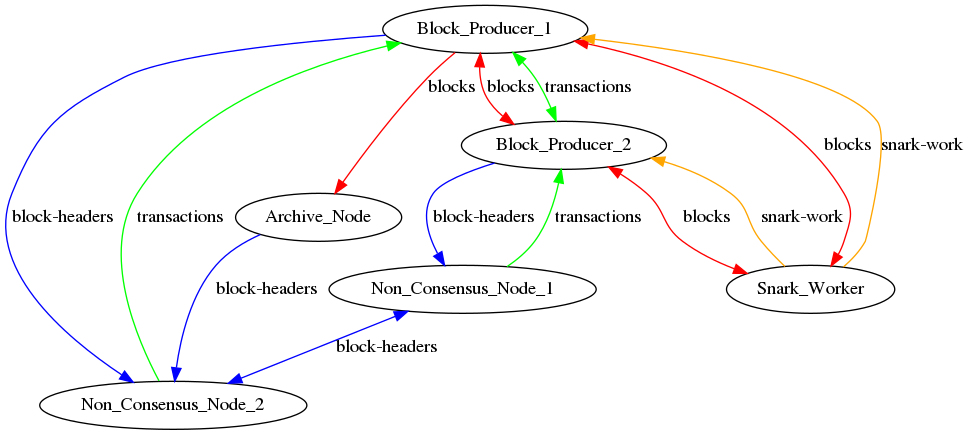

## Summary

This RFC proposes a design for a protocol that allows users in low-capacity environments such as browsers, smartphones, and some desktops to verify the state of the network and perform operations such as retrieving account balance, sending payments etc with the same (similar) level of assurance as that of a full-node.

The node that follows this protocol, is called a non-consensus node and can verify the state of the network without having to store the entire state. These nodes do not produce blocks but track enough information required to verify the state of the network. They rely on block producers and archive nodes for all other data and can easily validate them. The aim is to also reduce bandwidth usage by requiring only a subset of information from the network.

## Requirements

Coda daemon should by default run the non-consensus node and be able to switch to being consensus nodes

A non-consensus node should perform the following operations:

    1. Verify the state of the network
    1. Get the state of an account (balance, nonce, receipt-chain hash)
    2. Send payments
    3. Check status of the payment made:
        a) Seen (added to the pool?)
        b) Processed
        c) Finalized
    4. View payments sent and received
        1. by querying an archive node maybe? (current wallet feature)
    5. Delegate an account's stake to a block producer

## Detailed design

Coda daemon can currently run the following nodes that are able to fully verify the state and store the entire state:
    1. Block producer
    2. Full node (does not produce blocks) (can be a seed node, a snark worker, an archive node etc)

A non-consensus node is a full node but with just enough state to perform the above listed requirements. Let's call this a block header (similar to the what light clients require in other blockchains)? Block headers are gossiped to the non-consensus nodes by block producers, full nodes, and other non-consesus nodes. With these block headers a non-consensus node can:
    1) Verify that the received block is valid in itself and represents a valid state of a chain
    2) determine the stronger block between two blocks, either (current and new / two new blocks heard)

A block header needs to have:

    1. Blockchain SNARK- A Proof that the state is valid
    2. Protocol_state:
        a) Previous state hash
        b) Blockchain State:
            a) Staged ledger hash
            b) Snarked ledger hash
        c) Consensus State

This is represented in `src/lib/blockchain_snark/blockchain.ml` using the type `Blockchain.t`

For a non-consensus node, the two main pieces of information that need to be tracked are:

    1. Block header at the best tip
    2. Block header at some block k such that the probability of a fork of length k is acceptably low (also known as finality)

##### Block header at the best tip

A non-consensus node needs a block header at the best tip to validate the account state and the status of transactions users are concerned with.
The ledger hash in staged ledger hash is the merkle root of the latest state of the ledger that has all the transactions on that chain applied to it.
A block header also has a snarked ledger hash which is for the ledger for which there is a SNARK that proves all the transactions claimed to be applied is indeed applied. By verfifying the blockchain snark, the non-consensus node also verifies this other snark also called a transaction snark without having to apply it themselves(recursive composition of zkSNARKS, wohoo!). A Snarked ledger is always behind the latest state at least by one block (in the case of max throughput during the steady state of the network ) and so wouldn't reflect the account state at the best tip. Hence we need to use staged ledger to look up the account state. However, unlike snarked ledger, the staged ledger does not have the SNARK that includes all the transactions generated yet. The blockchain snark currently does not guarantee anything about the staged ledger hash except that it exists and the transactions applied to it. [Here's](#Staged-ledger-validity) what we could do to change that.

Now that non-consensus nodes have the merkle root of the latest ledger, they can request merkle paths to their accounts from peers that store the full state and verify it agaisnt the staged ledger hash. With the account state from peers, a non-consensus node can:

1. Check the balance
2. Get the latest account nonce and use it to send transactions.(Also, infer the latest nonce from local transaction pool)
3. Check the status of sent transactions.This is achieved by comparing the receipt-chain hash from the account state.
For example if a non-consensus node sends transactions t1, t2, and t3 in that order and the reciept chain hashes are r1, r2, and r3 and if the account receipt-chain hash is r2 it would mean that t1 and t2 were included in the block and t3 is still pending.

An non-consensus node can delegate an account's state using the existing command `coda client delegate-stake`

##### Block header at some block k (root of the transition frontier)

For wallets to be able to show if transactions are finalized with a reasonable probability, non-consensus nodes will need to track the state of block at some length `v` such that the probablity of a fork of length `v` is extremely low.

On startup, a non-consensus node will request from its peers the block header at root and subsequent changes in the root need to be gossiped (layer 2). Given the root and the best tip, non-consensus nodes should be able to verify that they are indeed on the same chain. This is currently done using a merkle list of state hashes between the root and the best tip and the same can be used for non-consensus nodes as well.

With the block header at the root, non-consensus nodes can query the account state from the staged ledger materialized from the snarked ledger.

The value `v` in full nodes (called `k`) is currently 2160 which means, for a transaction to be finalized with a really high probability, it would take 10 days. That does not seem like a good user experience. Transactions on Bitcoin and Ethereum are finalized after 6 (~an hour) and 30 (~7mins) block respectively. They are able to achieve this because they have economic finality in that it becomes expensive to create a mallicious competing fork and therefore have low probablities at these values. However, that is not the case with proof of stake and therefore we have to pick a `v` at which there is a good enough probability.

Here are the probabilities that there will be a fork of length `v` assuming 40% of adversarial stake (\(\epsilon\)). `b` is the block_window_duration :

| v | fork probability ||| wait-time||||
|---|----------|--------|----------|----------|------|-----|-----|
||**$\epsilon =0.4$**|**$\epsilon =0.34$**|**$\epsilon =0.1$**| **$b = 6 mins$**(current) | **$b = 2 mins$** | **$b = 1 min$** | **$b = 30 secs$** |
| 5 | 0.49024 |0.386024|0.04501 |30m| 10m| 5m|2.5m|
| 30| 0.313376 |0.127204|2.3263e-06 |3h| 1 | 30m |15m|
| 50| 0.228895 |0.057254|1.04804e-09|5h| 1h 40m | 50m| 25m|
| 80| 0.146897 |0.0179358|1.01212e-14 |8h | 2h 40m | 1h 20m|40m|
| 100| 0.110262|0.00835778|4.59285e-18 |10h| 3h 20m |1h 40m |50m|
| 200| 0.0273769 |0.00019081|8.84e-35 |20h | 6h 40m |3h 20m|1h 40m|
| 300| 0.00697404 |4.43371e-06|1.70148e-51 |30h | 10h |5h|2h 30m|
| 400| 0.00179144 |1.0336e-07|3.27493e-68 |40h | 13h 20m |6h 40m|3h 20m|
| 500| 0.000461763 |2.4114e-09|6.30342e-85 |50h | 16h 40m |8h 20m|4h 10m|
<!--| 600| 0.000119216 |5.62686e-11|1.21325e-101 |60h | 20h |10h|5h|
| 700| 3.0803e-05 |1.31306e-12 |2.33521e-118 |70h | 23h 20m |11h 40m|5h 50m|
| 800| 7.96218e-06 |3.06414e-14 |4.49469e-135 |80h |26h 40m |13m 20m|6h 40m|
| 900| 2.05858e-06 | 8.00374e-16|8.65116e-152 |90h |30h |15h|7h 30m|
| 1000| 5.32297e-07|1.66863e-17|1.66513e-168 |100h | 33h 20m |16h 40m|8h 20m|-->

Whatever value of `v` we choose, the selection mechanism between the two blocks would still use the `k` defined for full nodes and therefore, the fork resolution rules will not be affected even in the case of forks of length greater than `v`.
Also, the above probabilities are for forks that are caused by adversarial behaviors. There can be forks due to random network partitions and since `v` is going to very small compared to `k` we have to consider forks due to short network partitions and determine their frequency/length in some heuristic way.

But within a parition, there is an assumption that all the nodes will resolve any fork of length 1 i.e., every node will be in sync on the best chain within `2*delta` slots if they hear about it. So `v` should be at least `2*delta` blocks (not using slots here to avoid cases when there are no blocks at all within this period since delta is small enough for that to be possible). The value of delta we want is ~4 therefore `v` >= 8 blocks. With the above probabilities for $\epsilon =0.34$, `v` = 50 seems good enough.

### Gossip layer

The gossip protocol for non-consensus nodes should be separated from the one for full nodes because messages like blocks, transactions, and snark works are not required and having a different gossip layer for messages pertaining to the non-consensus nodes will reduce the bandwidth usage significantly.

    1. Block Layer : Existing gossip layer that includes broadcasting blocks and snark pool diffs.
    2. Header Layer: New layer for gossiping information needed by non-consensus nodes- 
        a) Block headers
    3 Transaction Layer: For transactions that nodes can send. This is a separate layer because we don't want non-consensus nodes (or archive nodes/snark workers) to receive any transaction.

We can achieve this using the Publish/Subscribe mechanism implemented in libp2p.
Publish/Subscribe mechanism basically allows for sending and receiving messages corresponging to a specific `topic`. The interface for that is defined in `coda_net2.mli`:
    ```ocaml
type net

module Pubsub : sig
  (** A subscription to a pubsub topic. *)
  module Subscription : sig
    type t

    (** Publish a message to this pubsub topic.
    * It is exactly [Pubsub.publish] with the topic this subscription was
    * created for, and fails in the same way. *)
    val publish : t -> string -> unit Deferred.t

    (** Unsubscribe from this topic*)
    val unsubscribe : t -> unit Deferred.Or_error.t

    (** The pipe of messages received about this topic. *)
    val message_pipe : t -> string Envelope.Incoming.t Strict_pipe.Reader.t
  end

  (** Publish a message to a topic*)
  val publish : net -> topic:string -> data:string -> unit Deferred.t

  (** Subscribe to a pubsub topic.
    * incoming messages for that topic will be written to the
    * [Subscription.message_pipe t].
    *
    * [should_forward_message] will be called once per new message, and will
    * not be called again until the deferred it returns is resolved. The helper
    * process waits 5 seconds for the result of [should_forward_message] to be
    * reported, otherwise it will not forward it.
    *)
  val subscribe :
       net
    -> string
    -> should_forward_message:(   sender:PeerID.t
                               -> data:string
                               -> bool Deferred.t)
    -> Subscription.t Deferred.Or_error.t
end
    ```

The way we would use this to implement different layers of our gossip net is as follows:

New topic strings for gossipping blocks, block headers, and transactions will be created. A non-consensus node, to receive block headers, would first broadcast a subscription request to a certain topic created for block-headers, say `block-header` using `Pubsub.subscribe`.

Any node on receiving a subscription request would add the non-consensus node to its subscribers list corresponding to the topic.

Full nodes would then `Pubsub.publish` the block-header (A block without the staged-ledger-diff) to the topic `block-headers` on receiving/producing a block. [Why would they?](#Incentivizing-full-nodes) Other non-consensus nodes and full-nodes would forward the block-headers it received after validating it.

Similarly there can be another topic string, say `transaction`, for non-consensus nodes to broadcast transactions to block producers. Non-consensus nodes would only publish to this topic and full-nodes would publish and subscribe to the topic. Snark workers or archive nodes can choose to not subscribe to this topic since they don't produce blocks.

All other data such as snark works and blocks are gossiped in the `block` layer. We could have a separate topic for gossipping snark work since only block producers and snark workers would want to subscribe and publish to it respectively but by default full-nodes will subscribe and publish to both `transaction` layer and `block` layer.

Here's a network state that shows messages that would be gossiped


[TODO: We first have to implement gossip using libp2p]

Note: The routing mechanism for messages in this layer can be:

1. Flooding - which basically forwards an incomming message to all its peers. While this mechanism is highly robust, the messages would gobble up the bandwidth of well connected nodes. Given the low bandwidth environment the non-consensus nodes operate in, this is not good option. The go Pubsub package has the next two mechanisms implemented that would mitigate this problem

2. Randomsub: For every message to be sent, select upto a certain number of peers randomly. The message propagation would be non-deterministic here but that's ok?

3. Meshsub: Instead of selecting peers randomly for each message to be sent, the node would maintain a mesh (whenever a peer A is in the mesh of peer B, then peer B is also in the mesh of peer A) of randomly selected peers and broadcast all the messages to peers in that set making it somewhat more deterministic than Randomsub. When a new node joins it selects another random set of peers and adds it to the mesh

A note from the go pubsup library (https://github.com/libp2p/go-libp2p-pubsub) : Subscription is not an instanteneous operation. It may take some time before the subscription is processed by the pubsub main loop and propagated to our peers.

### Staged-ledger-validity

When a node verifies a blockchain snark, it also verifies the ledger state upto a certain sequence of transactions (all the transactions for which there is a ledger proof). The transactions that haven't been completely snarked yet, full nodes apply them to the ledger in staged ledger and verify the staged-ledger-hash that is part of the new block is equal to the one they generated. This however is not possible for non-consensus nodes because they don't have any state apart from the two different block headers. We can make this slightly better for the non-consensus nodes by having the block porducers commit to the transactions being included and having an in-snark check for preventing any possible transaction reversal

This can be done by chaining the ledger hash (of the ledger in the staged ledger) like we currently do for coinbases in the pending coinbase data structure.

The stack operations would now be:

    ``` ocaml
        module Stack : sig
            val push : t -> Coinbase.t option -> Frozen_ledger_hash.t -> t

            module Checked : sig
                val push : t -> Coinbase_data.var option -> Frozen_ledger_hash.var -> (t, 'a) Tick.Checked.t
            end
        end
    ```
The blockchain snark would then prove that the transactions included in a new ledger proof is infact what is expected by checking that the stack corresponding to the new ledger proof is the same as the one updated in the pending coinbase.

### Shared Libraries

Binary for non-consensus nodes can share the following libraries with the one for full-node:

    1. Gossip net
    2. Verifier (This needs fixing as it currently loads prover keys as well)
    3. Snarky libraries (update and reuse snarkette?)
    4. Best tip prover
    5. Network pool (for transactions)
    6. `select` function from the consensus library
    7. Account, Transaction, user command, blockchain state, consensus state and all its contents 

### Incentivizing-full-nodes

The aim is to run non-consensus nodes natively, on browsers and on mobile platforms using much less resources compared to full nodes. This makes it much more accessible for users to interact with the blockchain. However, non-consensus nodes don't participate in the consensus and full nodes have no direct incentive to gossip block headers or respond to other requests-

    1. Gossip block headers of root and the best tip along with the merkle-list of state hashes. These can be generated without any extra computational cost though
    2. Respond to merkle-path requests for every new block and new root

So, we need to think about ways to incentivize full nodes. Maybe-

 1. Pay a full node for fulfilling a request?
 2. Some sort of periodic fee for being a non-consensus node by associating it with an account?
