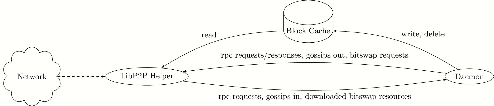

## Summary
[summary]: #summary

This RFC proposes adding Bitswap to our libp2p networking stack in order to address issues related to our current gossip network pub/sub layer.

## Motivation
[motivation]: #motivation

Mina has very large messages that are broadcast over the gossip net pub/sub layer. This incurs a high bandwidth cost due to the nature of our pub/sub rebroadcast cycles work in order to consistently broadcast messages throughout the network. For example, we observer blocks on mainnet as large as ~2mb. This would represent only a single block, and each block broadcast message has a multiplicative cost on bandwidth as it's being broadcast throughout the network. This bandwidth cost also translates into CPU cost due to the cost of hashing incoming messages to check against the de-duplication cache before processing them. We currently observe behaviors where the libp2p helper process can be pegged at 100% CPU on certain hardware setups when there is high pub/sub throughput on the network. Since gossip pub/sub is used not only for blocks, but also transactions and snark work, the broadcasting of each of these simultaneously ends up compounding the issue.

Implementing Bitswap in our libp2p layer will address this issue by allowing us to immediately reduce our pub/sub message size, while making the larger data referenced by pub/sub messages available upon request. It provides a mechanism for breaking up large data into chunks that can be distributed throughout the network (streamed back from multiple peers), and a system for finding peers on the network who are able to serve that data.

## Detailed design
[detailed-design]: #detailed-design

[Bitswap](https://docs.ipfs.io/concepts/bitswap/) is a module provided by [libp2p](https://libp2p.io/) that enables distributed data synchronization over a p2p network, somewhat comparable to how [BitTorrent](https://en.wikipedia.org/wiki/BitTorrent) works. It works by splitting up data into chunks called blocks (we will explicitly refer to these as "Bitswap blocks" to disambiguate them from "blockchain blocks"), which are structured into a DAG with a single root. When a node on the network wants to download to some data, it asks it's peers to see which (if any) have the root Bitswap block corresponding to that data. If none of the peers have the data, it falls back to querying the gossip network's [DHT](https://docs.ipfs.io/concepts/dht/#kademlia) to find a suitable node that can serve the data.

In this design, we will lay out an architecture to support Bitswap in our Mina implementation, along with a strategy for migrating Mina blocks into Bitswap to reduce current gossip pub/sub pressure. We limit the scope of migrating Mina data to Bitswap only to blocks for the context of this RFC, but in the future, we will also investigate moving snark work, transactions, and ledger data into Bitswap. Snark work and transactions will likely be modeled similarly to Mina blocks with respect to Bitswap, but ledger data will require some special thought since it's Bitswap block representation will have overlapping Bitswap blocks across different ledgers.

### Bitswap Architecture

In order to allow the libp2p helper process to serve Bitswap blocks without putting any pressure on the daemon process, a "Bitswap block cache" is introduced to the process architecture. This cache provides enough information for the libp2p process to be able to answer Bitswap requests (informing other peers which blocks in their want-list we have, and serving those blocks to peers upon request).



### Bitswap Block Format

Bitswap blocks are chunks of arbitrary binary data which are content addressed by [IPFS CIDs](https://docs.ipfs.io/concepts/content-addressing/#cid-conversion). There is no pre-defined maximum size of each Bitswap block, but IPFS uses 256kb, and the maximum recommended size of a Bitswap block is 1mb. Realistically, we want Bitswap blocks to be as small as possible, so we should start at 256kb for our maximum size, but keep the size of Bitswap blocks as a parameter we can tune so that we can optimize for block size vs block count.

While the Bitswap specification does not care about what data is stored in each block, we do require each block have a commonly-defined format that we can parse from the libp2p helper so that we can piece together a series of blocks into a single larger binary blob. In order to do this, we structure Bitswap blocks as DAGs, where nodes can contain both pointers to successors and binary data. We advertise the "root" block of each DAG as the initial block to download for each resource we store in Bitswap, and the libp2p helper process will automatically explore all the child blocks referenced throughout the DAG. To construct the full binary blob from this DAG, We do a depth first left fold over the DAG and stitch each splice of binary data together in that order. Dependent on our maximum resource binary size, it may be possible that every DAG we would want to advertise over Bitswap would be at most depth = 2, which could reduce complexity from the implementation. However, without having a good maximum resource binary size for that at the moment, we will initially support a more generic solution that technically allows for DAGs of unbounded sizes.

Below is a proposed representation of Bitswap blocks. In this example, we use bin_io to serialize the block format (since it's a simple enough message format that likely won't change regularly, seems not too difficult to implement some Go code to parse this data). However, should we have the networking refactor in place before we implement Bitswap, it would make more sense to use Cap'N Proto.

```ocaml
type block_cid = <<implementation of relevant version of IPFS CID>>
[@@deriving bin_io]

type bitswap_block = {refs: block_cid list; data: Bigstring.t}
[@@deriving bin_io]

(** ALTERNATIVE DEFINITION (requires custom serialization): **)
type bitswap_block =
  | Leaf of Bigstring.t
  | Branch of block_cid list * Bigstring.t
```

The algorithm for projecting a resource's binary representation into Bitswap blocks roughly goes as follows:
- compute the size of the binary blob
- compute how many blocks would be required to store this binary blob, accounting for the overhead of storing a CID reference per block computed
  - example given
    - if we have:
      - a binary blob of `blob_size`
      - a max Bitswap block size of `max_block_size`
      - each IPFS cid is of `cid_size`
      - and the maximum additional overhead of a serialized block (additional numbers to encode length of data portions) of `max_overhead_size`
    - we could compute this as:
      - **NB:** _Please double check my math above. History has proven I am not the best mathematician, and I could have gotten something wrong with my above math (would write some tests to confirm it when we go to implement it)._
      - `let base_block_size = max_block_size - max_overhead_size`
      - `let leftover_space s = s mod base_block_size`
      - `let num_blocks s = s / base_block_size + if leftover_space s = 0 then 0 else 1`
      - `let blob_cids_size = num_blocks blob_size - 1 * cid_size` (we subtract 1 here because we do not store a reference to the root block in a DAG)
      - `let num_overflow_cids_size = min 0 (blob_cid_size - leftover_space blob_size)`
      - `num_blocks blob_size + num_blocks num_overflow_cids_size`
- generate a block tree layout based on how many CIDs we need to store to refer to all the blocks (minus the root block)
- fill in slices of binary data, starting at the leaves; continue upward, propagating CIDs of child blocks to parents for inclusion in their representation)
- at the end, you have a set of blocks, with a single block being marked as the "root" block for the set

### Bitswap Block Cache

There exist some key constraints in choosing a good solution for the Bitswap block cache. Importantly, the cache needs to support a concurrent reader and writer at the same time. Additionally, the cache should be optimized for existence checks and reads, as these are the operations we will perform the most frequently against the cache. The cache should have a very short delay between when data is written and when it is visible to a reader, so that the libp2p helper process has that information available to serve to other nodes on the network upon broadcast of the root block CIDs. Finally, the cache would ideally be persisted, so that we can quickly reload the cache in the event of node crashes (we want to avoid increasing bootstrap time for a node, as that keeps stake offline after crashes).

Given these constraints, [LMDB](http://www.lmdb.tech/doc/) is a good choice for the Bitswap block cache. It meets all of the above criteria, including persistence.

#### Cache Schema

The Bitswap block cache stores 2 key pieces of information: a set of blocks that are available to serve over the network, and a mapping from Mina CIDs and Bitswap block CIDs. To be specific, most resources we want to serve over Bitswap already have content identifiers (hashes) that are computed in the daemon and referenced in the blockchain state. The Bitswap block cache will provide a mapping between these existing CIDs and the set of Bitswap block CIDs that is projected from the resource, so that the Bitswap blocks do not need to be all recomputed in the event of restarts, and we do not need to compute these Bitswap blocks in order to determine what resources are stored in the cache.

| Key                  | Value Type                                                  |
|----------------------|-------------------------------------------------------------|
| `res:${mina_cid}`    | `block_cid list` (first entry is the cid of the root block) |
| `block:${block_cid}` | `bitswap_block`                                             |


#### Synchronization Model

Synchronizing information from the daemon with the Bitswap block cache involves tracking a series of resources and how they relate back to Bitswap blocks stored in the cache. We already follow a pattern in the daemon in which we cache the CIDs of resources in memory to avoid recomputing them (example given: we wrap blocks and breadcrumbs in `With_hash.t`). In addition to this, for any resources we want to advertise over Bitswap, we will want to track both the Mina CID and the set of Bitswap block CIDs that comprise that resource's Bitswap block projection.

There are multiple ways in which a daemon can determine the set of Bitswap block CIDs, related to how the daemon acquired that resource in the first place.

1. If the daemon generated the resource, then it needs compute the Bitswap block projection of that resource in order to determine the Bitswap block CIDs.
2. If the daemon loaded the resource on startup (from persisted state), then it can defer to the Bitswap block cache to determine the CIDs. If the Bitswap block cache data is incomplete, corrupted, or missing, then the daemon needs to recompute the Bitswap block projection.
3. If the daemon downloaded the resource from the network (via Bitswap), then the libp2p helper will inform the deamon of the set of Bitswap CIDs for that resource.

#### Caching Protocols

When the daemon is in the participation state, all Bitswap advertisable resources will be actively synced with the cache by performing "add resource" or "remove resource" operations as new resources are added and garbage collected from the daemon's internal state.

<!-- The daemon will perform the following interactions with the Bitswap cache: -->

**add resource**
- compute Bitswap block data projection for resource
- write `res:${mina_cid}` with all Bitswap block cids for the current resource
- write a `block:${block_cid}` entry for each Bitswap block
- store Bitswap block cids in memory, for later retrieval
- throw away Bitswap block data projection

**remove resource**
- load Bitswap block cids for resource
- delete each `block:${block_cid}` entry pointed to by the set of Bitswap block CIDs for this resource
- delete the `res:${mina_cid}` entry related to this resource

**resync resources (after bootstrap, before participation)**
- load all daemon resources into memory
- query all `res:*` keys to get the set of resources stored in cache
- diff daemon resource hashes against set of resources stored in cache
- perform "remove resource" for all resources in cache, but not in memory
- perform "add resource" for all resources in memory, but not in cache
- for all resources both in memory and in cache
  - read `res:${mina_cid}` to get the list of block CIDs associated with the resource in the cache
  - sanity check that all reference block CIDs exist in cache (check DAG integrity)
  - record block CIDs in memory to avoid computing block data projection for relevant resources

#### Synchronization Subsystem

The daemon will have a new subsystem which will track the creation/destruction of resources, and perform the necessary caching protocols. Tracking the destruction of resources will be done using a GC finalizer. We cannot perform the "remove resource" caching protocol from inside of a finalizer, so the finalizer will merely mark removed resources for the subsystem to later remove from the Bitswap block cache when the Async scheduler schedules the subsystem to run.

**NB:** _This proposed model makes an assumption that each DAG stored in Bitswap will not have any cross references (that is, no 2 DAGs will contain any of the same Bitswap blocks).This model simplifies the initial implementation for storing Mina block bodies, but does not mesh well with the world in which we store ledgers (where it is likely that multiple ledger DAGs share blocks across various roots). We will need to layer a refcounting solution on top of this to support that use case, when the time comes, which will involve adding an extra key-value table to the Bitswap block cache schema._

```ocaml
module Bitswap = struct
  type cid = <<elided>>
  type block = <<elided>>
  type block_tree = Bitswap.block * Bitswap.block list

  module type Bitswap_advertisable_intf = sig
    (* we use the bin_io interface here to serialize/deserialize the binary data stored in blocks *)
    type t [@@deriving bin_io]

    type create_args

    val create : create_args -> t

    (* mapping from an object to a mina cid *)
    val id : t -> Mina_cid.t 

    val project_bitswap_blocks : t -> block_tree
  end

  type 'a advertisable = (module Bitswap_advertisable_intf with type t = 'a)

  module Sync_state = struct
    (* global sync state *)
    let sync_table = Mina_cid.Table.create ()

    (* runs a continuous background task to synchronize resources tracked in the daemon with the Bitswap cache *)
    let run_sync_task () =

    (* track a new resource in global state *)
    let track ((module Resource) : 'a advertisable) (resource : 'a) =
      ...

    (* mark a resource currently tracked in global state to be processed for collection in a future async cycle *)
    let mark_for_collection ((module Resource) : 'a advertisable) (resource : 'a) =
      ...
  end

  module Bitswap_advertised (Resource : Bitswap_advertisable_intf) = struct
    type t = Resource.t

    let create init_args =
      let resource = Resource.create init_args in
      Sync_state.add (module Resource) x ;
      Gc.Expert.attach_finalizer x (fun _ -> Sync_state.mark_for_removal (module Resource) x) ;
      x
  end
end
```

### Libp2p Helper IPC Modifications

New IPC messages are required in order to support the daemon requesting resources stored in Bitswap blocks from the helper process. When the daemon needs to acquire a resource that is stored in Bitswap, it will send a message to the libp2p helper process asking it to download all the blocks associated with that resource (identified by the root Bitswap block CID). The helper process will begin the process of downloading all Bitswap blocks in the tree pointed to by the root Bitswap block, and will inform the helper upon success or failure of that operation. The helper process will be responsible for tracking a timeout of the download operation, and fail the operation if that timeout is exceeded.

Whenever new Bitswap blocks are available to the node, the libp2p helper needs to mark an entry in the DHT saying that our node can provide this block of data. When the blocks in question are downloaded from another peer in the network, this is done [automatically by the libp2p Bitswap implementation](https://github.com/ipfs/go-bitswap/blob/0fa397581ca6197c6c4ca17842719370f6596e95/bitswap.go#L254). However, we still need to have custom logic for adding new DHT provision keys for data we broadcast from out node locally, and when a node restarts from with a pre-existing Bitswap block cache.

In order to support this, whenever we submit [new pub/sub broadcast messages from the daemon](https://github.com/MinaProtocol/mina/blob/develop/src/app/libp2p_helper/src/libp2p_helper/main.go#L452), the daemon will include a list of Bitswap block CIDs associated with any extraneous data related to the broadcast message. The libp2p helper process will mark these in the DHT.

We do not need to worry about advertising persisted block CIDs on restarts so long as the node is restarted with the same libp2p keypair, as the DHT records informing what block CIDs can be served by this node will persist on the network after the node goes offline. We also don't need to concern ourselves with pruning garbage collected block CIDs from the DHT since all provide keys we store there only persist for 24 hours.

To summarize, the following changes will be made to the libp2p helper IPC protocol:

- daemon -> helper
  - add `GetResource(root_cid: CID)` :: Informs the helper to begin downloading the resource stored under the specified root Bitswap block CID.
  - modify `Publish(topic: String, block_cids: [CID], data: RawBinaryData)` :: This message now includes a list of CIDs associated with the newly published message, which the libp2p helper will then `Provide` to the DHT.
- helper -> daemon
  - add `DownloadedResource(root_cid: CID, blocks: Map<CID, Block>)` :: Returns a requested resource to the daemon process.
  - _(if we decide to move to 2-writer or proxy-writer model)_
    - _add `DownloadedResource(root_cid: CID, cid_set: [CID], data: RawBinaryData)` :: Returns a requested resource to the daemon process._
  - add `ResourceDownloadError(root_cid: CID, error: String)` :: Informs the daemon that a requested resource could not be downloaded.

### Migrating Mina Blocks to Bitswap

To migrate Mina block propagation to Bitswap, we will separate a Mina block into 2 portions: a block header, and a block body. Most of the data in a Mina block is stored inside of the `staged_ledger_diff`. The common data in every Mina block is ~8.06kb (including the `protocol_state_proof`), so using everything __except__ for the `staged_ledger_diff` as the block header seems natural. The `staged_ledger_diff` would then act as the block body for Mina blocks, and would be downloaded/made available via Bitswap rather than broadcast over pub/sub.

When blocks are broadcast through the network now, only the block header and a root CID for the `staged_ledger_diff` are in the message. When a node receives a new block header, the node will first verify the `protocol_state_proof` (all public information that needs to be fed in for proof verification will be available in the block header). Once the proof is checked, a node would then download the `staged_ledger_diff` via Bitswap. Once that is downloaded, the node would follow the same pattern right now for generating a breadcrumb by expanding the `staged_ledger` from the parent breadcrumb and the new `staged_ledger_diff`, after which the Mina block will be fully validated. At this point, the breadcrumb is added to the frontier.

One large difference from before, however, is that nodes will rebroadcast the block header to other nodes on the network before the `staged_ledger_diff` is downloaded and verified, in order to avoid increasing block propagation time on the network with the new addition of Bitswap. This change brings some unique problems that we need to solve now, as previously, we wouldn't forward Mina blocks to other nodes until we knew the block was fully valid. In the new world, an adversary could broadcast around the same block header and proof, but swap out the `staged_ledger_diff` root Bitswap block CID with different values to attack the network. In order to prevent this, we must now include a commitment in the snark not only to the target staged ledger hash, but also the root Bitswap block CID of the `staged_ledger_diff` that brings us to that state. This makes the attack more expensive to preform since you need to generate a proof for each `staged_ledger_diff` the adversary wants to broadcast erroneously to the network. In addition to this, we will make a rule such that, if a node ever downloads a `staged_ledger_diff` which does not achieve the target staged ledger hash after application to the parent staged ledger, that node will ban the block producer public key of whoever produced that block. This further removes the incentive to perform this kind of attack, since an adversary doing so would lose their ability to submit blocks to nodes in the future.

In summation, the proposed changes in order to move Mina blocks into Bitswap are:

1. Define separate block header (block w/o `staged_ledger_diff` with new field `staged_ledger_diff_root_cid`).
2. Add `staged_ledger_diff_root_cid` as a public input to the blockchain snark.
3. Rebroadcast block headers after proofs are checked, but before `staged_ledger_diff`s are verified and the breadcrumb is added to the frontier.
4. Punish block producer public keys if they submit an invalid `staged_ledger_diff` by ignoring all future block headers from that producer (do not punish senders, as they may not have banned or checked the `staged_ledger_diff` yet).

_For reference on the above computation of ~8.06kb for a block without a staged ledger diff, here is a snippet of OCaml code that can be run in `dune utop src/lib/mina_transition`_

```ocaml
let open Core in
let open Mina_transition in
let precomputed_block = External_transition.Precomputed_block.t_of_sexp @@ Sexp.of_string External_transition_sample_precomputed_block.sample_block_sexp in
let small_precomputed_block = {precomputed_block with staged_ledger_diff = Staged_ledger_diff.empty_diff} in
let conv (t : External_transition.Precomputed_block.t) =
  External_transition.create
    ~protocol_state:t.protocol_state
    ~protocol_state_proof:t.protocol_state_proof
    ~staged_ledger_diff:t.staged_ledger_diff
    ~delta_transition_chain_proof:t.delta_transition_chain_proof
    ~validation_callback:(Mina_net2.Validation_callback.create_without_expiration ())
    ()
in
Protocol_version.set_current (Protocol_version.create_exn ~major:0 ~minor:0 ~patch:0) ;
External_transition.Stable.Latest.bin_size_t (conv small_precomputed_block) ;;
```

### Shipping as a Soft-Fork

We have an option to ship Bitswap as a soft-fork upgrade rather than as a hard-fork upgrade (shoutout to @mrmr1993 for this suggestion; writing this nearly verbatim from him). We can do this by adding a new pub/sub topic for broadcasting the new block header broadcast message format, which we can support in parallel to the current pub/sub topic we use for all of our broadcast messages. We currently use the `"coda/consensus-messages/0.0.1"` topic for blocks, transactions, and snark work. Nodes running the new version of the software can still support this topic, but in addition, can subscribe to and interact over a new topic `"mina/blocks/1.0.0"`, where we can broadcast the new message format for blocks. Nodes are able to filter subscriptions from other nodes based on what they subscribe to, configured using the [`WithSubscriptionFilter` option](https://github.com/libp2p/go-libp2p-pubsub/blob/55d412efa7f5a734d2f926e0c7c948f0ab4def21/subscription_filter.go#L36). Utilizing this, nodes that support the `"mina/blocks/1.0.0"` can filter out the `"coda/consensus-messages/0.0.1"` topic from nodes that support both topics. By filtering the topics like this, nodes running the new version can broadcast new blocks over both topics while avoiding sending the old message format to other nodes which support the new topic. Then, in the next hard fork, we can completely deprecate sending blocks over the old topic.

The main detail to still figure out here is how new nodes will bridge the new topic messages to the old topic. It may be as simple as just broadcasting the block as a fresh message on the old topic, but that isn't normally how a pub/sub rebroadcast cycle would operate. This approach may "just work", but we should do additional research into what differentiates a libp2p pub/sub broadcast from a rebroadcast. If it turns out the only difference is how we select which peers to send the message to, the proposed topic filtering solution may address it automatically.

## Drawbacks
[drawbacks]: #drawbacks

This adds significant complexity to how the protocol gossips around information. The control flow for validating blocks is more complex than before, and there is new state to synchronize between the processes in the architecture. It also adds new delays to when the full block data will be available to each node (but the tradeoff here is that we are able to more consistently gossip block headers around the network within the same slot those blocks are produced).

## Rationale and alternatives
[rationale-and-alternatives]: #rationale-and-alternatives

- it would be possible to download larger data from peers via RPC and still reduce the pub/sub message size, though there are some issues with this approach
  - it is not guaranteed that any of your peers will have the data you need, in which case you need some alternative mechanism to discover who does have it
  - puts a lot of bandwidth pressure on individual peers rather than spreading the load between multiple peers (which helps with both bandwidth pressure and data redundancy for increase availability)
- alternatives to using LMDB as the Bitswap cache
  - use [SQLite](https://www.sqlite.org/index.html)
    - even though all we need is a key/value db, not a relational db, SQLite is portable and performant
    - would require us to enable both the [write-ahead logging](https://sqlite.org/wal.html) and use [memory-mapped I/O](https://www.sqlite.org/mmap.html) features in order to use it the way we would like to
  - use raw Linux filesystem (from @georgeee)
    - would use a lot of inodes and file descriptors if we do not build a mechanism that stores multiple key-value pairs in shared files, which could prove tricky to implement
    - would need to solve concurrency problems related to concurrent readers/writers, which could be tricky to get correct and have confidence in

## Unresolved questions
[unresolved-questions]: #unresolved-questions

- should we ship this as a hard fork, or should we take the extra work to ship this as a soft fork?