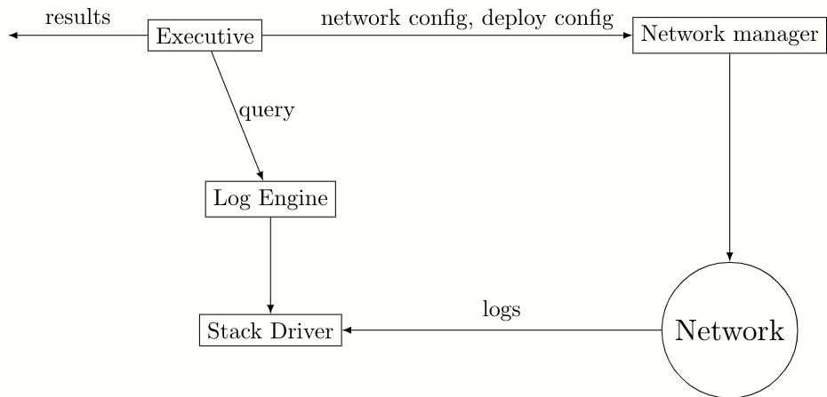

# Infrastructure Specification for Integration tests

## Goal

To specify the interfaces between different components and the interactions involved in executing an integration test. More concretely, proposing a spec for a Test Executive (pretty close to the one defined [here](https://github.com/CodaProtocol/coda/pull/4715). The role of a test executive is to bring together various components involved in executing an integration test and coordinating the interactions among them.
These components are:
    1. Testnet infrastructure: Given a network configuration, deploys a testnet for a specific infrastructure.
    2. Test: Defining the integration test itself
    3. Logging: Consuming logs from the deployed testnet for validation
    4. Automated validation: Defines and executes network-wide validations (Out of scope)

The goal is to have a system where each of these components can be independently implemented and the test executive will be responsible for initializing them and facilitating the interactions.

## Design

### Existing

Integrations tests are currently run on a simulated network using local processes. The test controls and inspects the nodes by communicating over RPC. The tests are tightly coupled to the simulated network and cannot be ported to run on cloud-based or container-based environments. More information on the motivation is described in this [rfc](https://github.com/CodaProtocol/coda/pull/4715) (TODO: Copy it to make it easier to read?)

### Improvements

The proposal for the test executive is part of the whole integration test framework revamp to address the drawbacks of the existing framework (#4735).

### Proposal

#### Infrastructure configuration

#### Test executive

The test executive requires the following inputs to successfully execute an integration test

1. Genesis constants and ledger:
`Runtime_config.t` currently has all the configurable constants and ledger

A ledger can be specified in any of the following way:

```ocaml

module Accounts = struct
  type single =
    { pk: string option [@default None]
    ; sk: string option [@default None]
    ; balance: Currency.Balance.t
    ; delegate: string option [@default None]
    ; timing: Account.Timing.t option [@default None]
    ; token_id : Token_id.t option  [@default None]
    }
end

module Ledger = struct
  type base =
    | Named of string  (** One of the named ledgers in [Genesis_ledger] *)
    | Accounts of Accounts.t  (** A ledger generated from the given accounts *)
    | Hash of string  (** The ledger with the given root hash *)
end
```

Therefore, one could either use compiled ledgers or generate a new json list using the Testnet SDK from coda_automation.
Note: Timing and token id are new fields added to the genesis account configuration that is needed to test time locked accounts and accounts with non-default token ids.

These configurations could be hardcoded in each test but not in coda daemon. The aim is to have a generic coda binary that that would accept the runtime configuration defined for each test

2.Network config: the configuration for the network the integration test will run on.

```ocaml

(*flags that we may want to specify for each daemon*)

type block_producer_flags = {
      coinbase_receiver: Public_key.Compressed.t
}

type snark_coordinator_flags = {
      snark_worker_fee: Fee.t
    ; work_reassignment_wait: int
    ; work_selection: `Seq | `Random
    ; worker_key: Public_key.Compressed.t option
}
(* The block producer keys would be 1 to [count] in the ledger and any non-default flags*)
type block_producers = {count : int; flags: block_producer_flags list }

type archive_nodes = {count: int}

(* Each snark coordinator is associated with a key and a fee. Snark coordinator keys will be from [block_producers.count]+1 to [block_producers.count]+[count] in the ledger. Alternatively, a specific snark-coordinator key that may not be in the ledger can be specified using the `worker_key` in snark_coordinator_flags to test new snark workers joining the network.
All the proofs generated by the workers connected to the coordinator is associated with the snark-coordinator key and the fee. Each coordinator has a set of workers that would get work from the coordinator and submit proofs for the same.*)
type snark_coordinator = { count : int; with_unique_keys: int; workers_per_coordinator: int; flags: snark_coordinator_flags list }

type t = {
      block_producers: block_producers
    ; snark_coordinators: snark_coordinators
    ; archive_nodes: archive_nodes }

```

3.Integration test: This is the program that defines the integration test written in a custom DSL (#4766)
The inputs to the test executive (network config and runtime config) can be passed to this program

A test executive will interact with the two main components as shown in the image :

1. Network manager
2. Log engine



##### Network Manager

A network manager is basically a wrapper around the network infrastructure using which a testnet is deployed. The network manager implemented in ocaml would take as input a network configuration and use it to generate required configuration for the deployment and deploy a testnet. The network manager is responsible for creating the seed nodes that other nodes can connect to. A separate network manager would be created for each environment where we want to run the testnet. The choice of a network manager is made by the test executive based on a user input (whether to run locally or on the cloud). The interface between a network manager and the test executive exposes all the nodes and the commands that can be issued to the nodes.

In the current testnet infrastructure, a network manager would generate the necessary terraform configuration files and deploy using terraform.
To run it locally, using minikube perhaps, we would create another network manager that deploys a testnet locally.

The network manager itself can be specified as:

```ocaml

module Node : Node_intf
(* Deploy the network*)
val deploy : Network_config.t -> Daemon_config.t -> Testnet.t Deferred.t

(*Tear down the network*)
val destroy : Testnet.t -> unit Deferred.t
```

```ocaml

module type Node_intf = sig
    type t

    val node_id_json : t -> json

    val start : t -> unit Deferred.t

    val stop : t -> unit Deferred.t

    ...
end

module type Testnet = sig

    type t =
        {
          block_producers : Node.t list
        ; snark_coordinators: Node.t list
        ; archive_nodes: Node.t list
        ; ... }
end
```

A node will encapsulate all the information needed to connect to it and make requests such as sending payments, retrieving a node's status, and so on. These requests implemented by the network manager could be using graphql commands. Given our intention to make all the cli commands use graphql queries, cli commands that do not currently have a graphql query should have that implemented first.
Also, care should be taken to not add any test-specific queries/mutations/subscriptions that would not be used by users.

The interface should also implement functions to start and stop a node that can be triggered at any time by the test program. This is particularly needed for testing functionalities like bootstrap and catchup. The network infrastructure should facilitate stopping and restarting coda daemon containers (with or w/o persisting the config directory). Currently a pod or a container within a pod is restarted automatically every time the daemon terminates. This behavior should be changed to support restarting a node on request.

The following are some of the options to enable restart on request:
    1. Have another process as the root of the container that initiates or terminates coda daemon based on a request from the network manager.
    2. Deleting and redeploying helm releases for stop and start requests from the network manager with stateful sets implemented.

Option 1 requires implementing and maintaining another application but is independent of the infrastructure and decoupled from the test executive. It does not change the state of the pod due to containers exiting with zero or non-zero codes and therefore once deployed, no changes are made to the deployment until it is destroyed after the test execution. The main process of the container would always be running starting/stopping the local coda daemon process as per requests from the executive. However, it is generally not considered as container best practice to include multiple services within a container.
Option 2 requires implementing stateful sets (which is to be implemented for testnet deployment anyway) and having coda-automation support redeploying specific nodes during the test execution. Option two provides a better architecture in terms managing the lifecycle of the nodes. However, these are currently not implemented and in the interest of having the test framework up and running to test the interactions between various components in the framework, we would implement a fairly simple puppeteering service while continuing to design the solution that uses stateful sets and incremental deployment.

##### Log engine

Similar to the network manager, a log engine is also a wrapper around the logging infrastructure we'd use. The log engine will provide functions that would filter the logs from all the nodes in the network. Log engine queries correspond to the required primitives for the test DSL, for example, the `wait_for` primitive defined [here](https://github.com/CodaProtocol/coda/blob/rfc/integration-tests/docs/test_dsl_spec.md) would return when block production logs with the given filters are seen.

Currently we use Stackdriver as our logging infrastructure for testnets and qa-nets. Using stackdriver, one can set up a pub/sub system to subscribe to a topic ([for more information](https://cloud.google.com/pubsub/docs/quickstart-py-mac)). Log filters can be added to a subscription and so only log messages that match the filter will be published to the topic. Each query defined in the log engine would correspond to a specific topic.

Here's a rough structure of the test executive and how it links different components

Assumption: (as a CI step)
    1. generate and upload the docker image
    2. generate genesis proof, genesis ledger, and PV keys with the input runtime configuration using `runtime_genesis_ledger.exe` and upload it to s3

```ocaml

    module type Make_test_intf = functor (Node: Node_intf) :
        (sig
            val execute : (module Log_engine : Log_engine_intf) -> Testnet.t -> Runtime_config.t -> bool Deferred.t
            end)

    module Test_executive
        (Make_test : Make_test_intf)
        ( Config : sig
            val runtime_config : Runtime_config.t
            val network_config: Network_config.t
            end) =
    struct  =

        let execute () =
            let deploy_config = {daemon_image}
            in
            (*deploy the network*)
            let%bind testnet : Testnet.t = Cloud_network_manager.deploy network_config daemon_config
            in
            (*create the log engine based on the testnet configuration*)
            let module Log_engine = Make_log_engine (struct
                let testnet = testnet
                end)
            in
            (*Test module for the specific Node implementation*)
            let module Test = Make_test (Cloud_network_manager.Node)
            in
            (*Execute the test*)
            let%bind result = Test.execute Log_engine testnet runtime_config
            in
            (*Teardown the network*)
            let%map () = Cloud_network_manager.destroy testnet
            in
            if not result then failwith "Test failed" else ()

    end
```

## Outstanding Questions/Concerns

1. Would we be running all the tests with snarks? Currently we run integration tests with different proof levels (full | check | none). Some of the tests like the delegation test or bootstrap test that run without snarks would take really long time to complete with proof-level=full.
2. Snark coordinators currently don't sync with each other which makes it a waste of resources to allow multiple coordinators.
3. gcloud authentication from CI
4. Logging infrastructure when running the tests in local environments. This also affects the automated validation when we integrate it with the testing framework.
