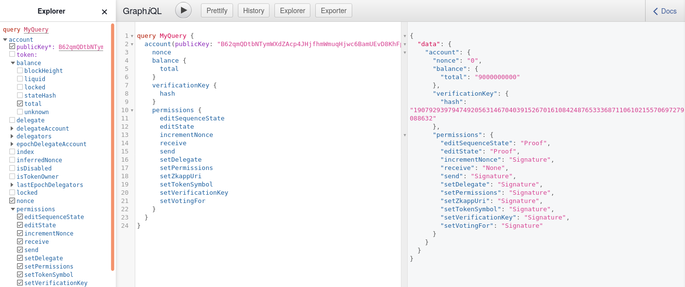
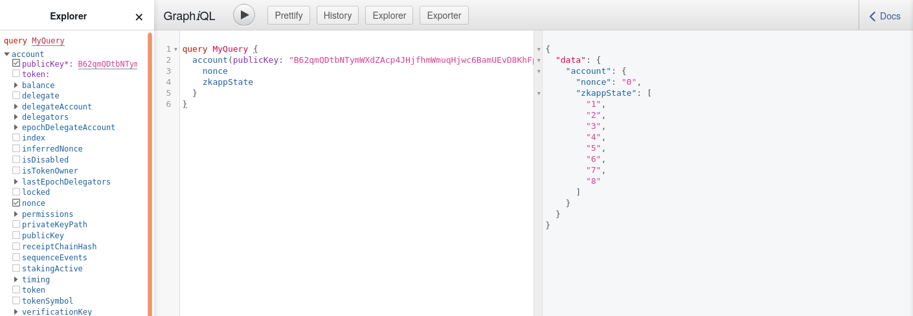

# ZkApp test transaction tool

A tool to generate zkapp transactions that can be sent to a mina test network. For more information on zkapps, checkout the following resources: https://docs.minaprotocol.com/en/zkapps.
The WIP progress spec [here](https://o1-labs.github.io/snapps-txns-reference-impl/target/doc/snapps_txn_reference_impl/index.html) proposes the structure and behavior of mina zkapp transactions.

The smart contract (which users might write using snarkyJS) used in the tool is intended only for testing as it does no operation on the state and simply accepts any update. The tool provides options to deploy this smart contract to a mina account and make various updates to the account

#### Usage

The tool generates a graphQL `sendZkapp` mutation that can be sent to the graphQL server the daemon starts by default at port 3085. One can use the UI to interact with the local graphQL server mounted at http://localhost:3085/graphql and paste the graphQL object that the tool prints

The commands proivded by this tool are-

```shell
$mina-zkapp-test-transaction -help
ZkApp test transaction

  zkapp_test_transaction.exe SUBCOMMAND

=== subcommands ===

  create-zkapp-account            Generate a zkApp transaction that creates a
                                  zkApp account
  upgrade-zkapp                   Generate a zkApp transaction that updates the
                                  verification key
  transfer-funds                  Generate a zkApp transaction that makes
                                  multiple transfers from one account
  update-state                    Generate a zkApp transaction that updates
                                  zkApp state
  update-zkapp-uri                Generate a zkApp transaction that updates the
                                  zkApp uri
  update-sequence-state           Generate a zkApp transaction that updates
                                  zkApp state
  update-token-symbol             Generate a zkApp transaction that updates
                                  token symbol
  update-permissions              Generate a zkApp transaction that updates the
                                  permissions of a zkApp account
  test-zkapp-with-genesis-ledger  Generate a trivial zkApp transaction and
                                  genesis ledger with verification key for
                                  testing
  version                         print version information
  help                            explain a given subcommand (perhaps
                                  recursively)
```

### Example usage

#### 1. Create a zkapp account / Deploy the test smart contract

`create-zkapp-account` command takes the following input to create a zkapp account and deploy the test smart contract. 

```shell
$mina-zkapp-test-transaction create-zkapp-account -help
Generate a zkApp transaction that creates a zkApp account

  zkapp_test_transaction.exe create-zkapp-account 

=== flags ===

  --fee-payer-key KEYFILE      Private key file for the fee payer of the
                               transaction (should already be in the ledger)
  --nonce NN                   Nonce of the fee payer account
  --receiver-amount NN         Receiver amount in Mina
  --zkapp-account-key KEYFILE  Private key file to create a new zkApp account
  [--debug]                    Debug mode, generates transaction snark
  [--fee FEE]                  Amount you are willing to pay to process the
                               transaction (default: 1) (minimum: 0.003)
  [--memo STRING]              Memo accompanying the transaction
  [-help]                      print this help text and exit
                               (alias: -?)
```

For example:

```shell
$mina-zkapp-test-transaction create-zkapp-account --fee-payer-key my-fee-payer --nonce 0 --receiver-amount 2 --zkapp-account-key my-zkapp-key
```

generates the following graphQL object- a zkapp transaction as input to the `sendZkapp` mutation. A zkapp transaction is basically a list of parties where each [party](https://o1-labs.github.io/snapps-txns-reference-impl/target/doc/snapps_txn_reference_impl/party/index.html) is an update performed on an account.

The zkapp transaction here has three parties-

1. the fee payer party which specifies who pays the transaction fees and how much
2. A party that pays the account creation fee to create the new zkapp account which in this case is the same as the fee payer
3. A party to create a new zkapp account, set its verification key associated with the test smart contract, and update `editState` and `editSequenceState` permissions to use proofs as [authorization](https://o1-labs.github.io/snapps-txns-reference-impl/target/doc/snapps_txn_reference_impl/party/enum.PartyAuthorization.html).

The authorization used in each of the parties here is a signature of the respective accounts i.e., the updates on these accounts are authorized as per the accounts' permissions.

```
mutation MyMutation {
  __typename
  sendZkapp(
    input: {
      parties: {
        feePayer: {
          body: {
            publicKey: "B62qpfgnUm7zVqi8MJHNB2m37rtgMNDbFNhC2DpMmmVpQt8x6gKv9Ww"
            update: {
              appState: [null, null, null, null, null, null, null, null]
              delegate: null
              verificationKey: null
              permissions: null
              zkappUri: null
              tokenSymbol: null
              timing: null
              votingFor: null
            }
            balanceChange: "1000000000"
            events: []
            sequenceEvents: []
            callData: "0"
            callDepth: 0
            protocolStatePrecondition: {
              snarkedLedgerHash: null
              timestamp: null
              blockchainLength: null
              minWindowDensity: null
              totalCurrency: null
              globalSlotSinceHardFork: null
              globalSlotSinceGenesis: null
              stakingEpochData: {
                ledger: { hash: null, totalCurrency: null }
                seed: null
                startCheckpoint: null
                lockCheckpoint: null
                epochLength: null
              }
              nextEpochData: {
                ledger: { hash: null, totalCurrency: null }
                seed: null
                startCheckpoint: null
                lockCheckpoint: null
                epochLength: null
              }
            }
            accountPrecondition: "0"
          }
          authorization: "7mXEzaufjDaZ3BkxpCnFziJt4L99gHzUPA13pGGTspt4gndnnxaMUvdQXprzQ3u4MEQixHb2iDbaKFUZSWgHEo7xyTa5f6Rh"
        }
        otherParties: [
          {
            body: {
              publicKey: "B62qpfgnUm7zVqi8MJHNB2m37rtgMNDbFNhC2DpMmmVpQt8x6gKv9Ww"
              tokenId: "wSHV2S4qX9jFsLjQo8r1BsMLH2ZRKsZx6EJd1sbozGPieEC4Jf"
              update: {
                appState: [null, null, null, null, null, null, null, null]
                delegate: null
                verificationKey: null
                permissions: null
                zkappUri: null
                tokenSymbol: null
                timing: null
                votingFor: null
              }
              balanceChange: { magnitude: "10000000000", sgn: "Negative" }
              incrementNonce: true
              events: []
              sequenceEvents: []
              callData: "0"
              callDepth: 0
              protocolStatePrecondition: {
                snarkedLedgerHash: null
                timestamp: null
                blockchainLength: null
                minWindowDensity: null
                totalCurrency: null
                globalSlotSinceHardFork: null
                globalSlotSinceGenesis: null
                stakingEpochData: {
                  ledger: { hash: null, totalCurrency: null }
                  seed: null
                  startCheckpoint: null
                  lockCheckpoint: null
                  epochLength: null
                }
                nextEpochData: {
                  ledger: { hash: null, totalCurrency: null }
                  seed: null
                  startCheckpoint: null
                  lockCheckpoint: null
                  epochLength: null
                }
              }
              accountPrecondition: {
                balance: null
                nonce: { lower: "1", upper: "1" }
                receiptChainHash: null
                publicKey: null
                delegate: null
                state: [null, null, null, null, null, null, null, null]
                sequenceState: null
                provedState: null
              }
              useFullCommitment: false
            }
            authorization: {
              proof: null
              signature: "7mXA83gWTqA3cEPPcNuNnMneJV6nxTjrQ1QPciJWxijkPYgqP2uD3zytzi6VD1jV1ZkcJkCsfjT82t1PuoxJ93Leu3YB5bRi"
            }
          }
          {
            body: {
              publicKey: "B62qmQDtbNTymWXdZAcp4JHjfhmWmuqHjwc6BamUEvD8KhFpMui2K1Z"
              tokenId: "wSHV2S4qX9jFsLjQo8r1BsMLH2ZRKsZx6EJd1sbozGPieEC4Jf"
              update: {
                appState: [null, null, null, null, null, null, null, null]
                delegate: null
                verificationKey: {
                  data: "4X1tWgjtpm8S5PqrYuTtmeUXriBHh6M8mDrXq3LGNnAVMCk6b5LkA9pzFk6h2D5FeuSppqURqfvUB6G4hrhAHJRzrr9sgbGvDdyKXCDuvzBL7bSDNfSDrRMGJ8QAX6cJbDYptwhKLEzv8DKKshvnzsMeMUxDwikSSpemhwALrASAS5RWdD7Sa79FsYgWduVTLk8P99WUgqP9zwj79PDWPp7QdMJomPL1bXT8Jr1YSu8xPZhDDxhpWgZXeEs2hHyJ1iz9xphSGQ3ayTDMHiuaiucT3zdmBCvKaNDuq2mDMRQ4TS6vzHReY5o3j6iBcRPyhEKmJQVWWgtZJ6J2ZY1cdYvCpi34vRYVTHuwYzYPpaE2i2F2jCJCs3Jrytdk1vfRX6BL9RxDtB1Ac1Wanbte8AZqHmd2yyY1rMZx13xpPBwdcH75d77htn3HRgW5LyuTwydNEU6fd4nVp9RPg5zFd6Y8de4HHNzwLjFXkLxN2QHMqCCNTCWALndFn3dzgkXJj8JTAYS4kxrJBiQQt97YBgdWXb1ZxKTTBcQwK23chuyaQSTzfH4fWQHTtqGxpwXfTorvrbkoiky6TXrfYkwiJHbt8S6g4bgbbBwLL9hRDAzumRSUDmEUjZVL3sLrBQa5kkyS5WUCb1EiaeRoETY8pSHKSAbNC5oDT8teQXrSkzyd86tH5EPMtCVuT3qBai1ZTjEHkVZNqDerFW4nzmKvCReVPLG4GWw6kmW1vxBY7B8zTvVKeNDzy6HkQRBYcmWU5fVvMpaDXYJetn16dmEGv5vx9vtjSsX7YRY7GdVuagS3FeFUSpX7g49LiDQPdxk26dXjsQonwoBYqE2MGyTuhf8vfyWaqs9iFV35LEDB5PP9ijV8qRyMZj52jPUEjrJueXWd89MUbpkabPQBbR2GNJaZCbcG6XkVc46HQjGw6wE6GhfpEVGPhupNZA4xwd51sR46sKfDnQeqoxzQRrYYyXEZM4Qu2c12XrZLQjsn9tN96JTCCgKTR9nesmKvxFBwxeWDFhoPv9UHUwphPvcp1uVd77W36pzjH7M3frotakNpx2UNC7H9cd5McAeYheoSBY6eUPm9EY7AvvFFEXiq18Nbt2omc327BVMkx3A62i6yTRJW2k7sNXhs4TBt4rVrYEHusvZsmNhby8rLPSB7ktwBMcrCGCeUFvu1da59NPvchjVw2d4TwT9uSuUaQGm2Tvu3TPsWpH1fx5akLMsSj534g3Zu8JNoDPrjD8RJ2WAK2m1gnEhW8jZeJypaj8JWeF4jBnW6UrcrpavXJbUZMmxHoEqsax21baB3nMudEbLFp4zaDUqXr9PqE9ZPueFqabXZHxRBFZ3CgdvMWHtAsh6dMvFb2tbxTLdcffW1bZBzVDccxW4PJWASs2ahVaNzNDNgkb1CAZaeBm8GDRS7izafdxJdE14VbLBg6PQZ5LnrCrLmcfuocq7GPRShKdDXSFfDLHwvpXbWQKpsdd3XTZyeT6TBQuKzKwAekrZwKsGSYdVWTVZJG3brAqqLTA8regvKneSSStBG6HoV9dsMrLMJh4ugr4bkP1MqqHBEwHD82kBPTpkU9VioboDJDHpMHGHzb169MmMTRD9qy85wTUbnEXM7cYUVz2VGqXYn9kbu95WLHhd9FKpDkvDMrgVVPzH9iuoHP8JSLT6WipawTiJSKjJZp6DtgdiTCwDBYfzHyj3KWpj5ogB2TBK96nEULLg8vkmtU4Xuw8SLr2RTdtYc699HHrUHqwneeLro2Mhu1ve6rm9dwpDbiNzfejijUpvJZi8VGh1G6Y1UN54soHRKdrN25yAgc3QTsvdSyyMs4gwk63mcjHQ8vKXd4f8Fpn1v3ZoXZ5xb1J1cbUgp7wYaPzWfe7i3ycC7DqcaUdubKCopyLynUPjkJ5omdJDZQZcs5tEHUFdBZEjBQe78u9yy5bgDknzkpnEkp8SzvKZdwFYbpigrro77XiJsvS5bj88i8tijx6hh2Ut4avj6aENzdLedLCL6b5ycX1jJnajLLeRbyPbhLz3rLvE6vrWuxZHQtAufEAZ11vyX7rxSRsvxMBzAcFo5z9oAQkHBsCYEU5eaEpsiaZER6qXauCxo1qi4NhFrjxDuJWp8irhFoR3Bqf4sccQjwcYhShZtyHyYEkZgFKcnJktF6s4xVMTidifw33bqfEk64q5a2UK4hxsL5RLmff8rqwCM57Fh7HwtRVNqHzCk4bxixpVYcc6eyB256WYQZar2JBJNMYDbYYCr97xANeTWJUxgZfdHjwoFRbyXibW83A24FkX6BmJ9NEqC5f15JG3Gv6EkN47EDu3UeaEgatTiqrJhwAjVSpKbYKBaKk11yJqzaH6GqD7JqyjS9oH4hAfx8pRWtH3bsRHWCh5JrKnXxtZon1Lm6tfCVFqgKmDpcVzh7NAHzx7cc6CbFv6y4SoqEmPZhHgewCFph1orcPeNzMx4BM3oBixF3mWZc3YD9UB"
                  hash: "19079293979474920563146704039152670161084248765333687110610215570697279088632"
                }
                permissions: {
                  editState: "Proof"
                  send: "Signature"
                  receive: "None"
                  setDelegate: "Signature"
                  setPermissions: "Signature"
                  setVerificationKey: "Signature"
                  setZkappUri: "Signature"
                  editSequenceState: "Proof"
                  setTokenSymbol: "Signature"
                  incrementNonce: "Signature"
                  setVotingFor: "Signature"
                }
                zkappUri: null
                tokenSymbol: null
                timing: null
                votingFor: null
              }
              balanceChange: { magnitude: "10000000000", sgn: "Positive" }
              incrementNonce: false
              events: []
              sequenceEvents: []
              callData: "0"
              callDepth: 0
              protocolStatePrecondition: {
                snarkedLedgerHash: null
                timestamp: null
                blockchainLength: null
                minWindowDensity: null
                totalCurrency: null
                globalSlotSinceHardFork: null
                globalSlotSinceGenesis: null
                stakingEpochData: {
                  ledger: { hash: null, totalCurrency: null }
                  seed: null
                  startCheckpoint: null
                  lockCheckpoint: null
                  epochLength: null
                }
                nextEpochData: {
                  ledger: { hash: null, totalCurrency: null }
                  seed: null
                  startCheckpoint: null
                  lockCheckpoint: null
                  epochLength: null
                }
              }
              accountPrecondition: {
                balance: null
                nonce: null
                receiptChainHash: null
                publicKey: null
                delegate: null
                state: [null, null, null, null, null, null, null, null]
                sequenceState: null
                provedState: null
              }
              useFullCommitment: true
            }
            authorization: {
              proof: null
              signature: "7mXM47EwEYXagt1AvxVqUjteeEJeFwi2yLx51j1SxZzjtJiGC1EALuL85MmgYLFU1MyHkQahnuwMW4nM9MfJoyQgpDGy18QR"
            }
          }
        ]
        memo: "E4YM2vTHhWEg66xpj52JErHUBU4pZ1yageL4TVDDpTTSsv8mK6YaH"
      }
    }
  )
}
```

Send the generated graphQL object to the local daemon via GraphiQL interface at http://localhost:3085/graphql 


After the transaction is sent and included in a block, a new zkapp account with the verification of the test smart contract gets created. The account information can be queried through the graphQL `account` query.

```
query MyQuery {
  account(publicKey: "B62qmQDtbNTymWXdZAcp4JHjfhmWmuqHjwc6BamUEvD8KhFpMui2K1Z") {
    nonce
    balance {
      total
    }
    verificationKey {
      hash
      verificationKey
    }
    permissions {
      editSequenceState
      editState
      incrementNonce
      receive
      send
      setDelegate
      setPermissions
      setZkappUri
      setTokenSymbol
      setVerificationKey
      setVotingFor
    }
  }
}
```


Query result:

```json
{
  "data": {
    "account": {
      "balance": {
        "total": "1000000000"
      },
      "verificationKey": {
        "hash": "11292887885696531659094127423705404064892721380499236041832155935416728493189"
      },
      "permissions": {
        "editSequenceState": "Proof",
        "editState": "Proof",
        "incrementNonce": "Signature",
        "receive": "None",
        "send": "Signature",
        "setDelegate": "Signature",
        "setPermissions": "Signature",
        "setZkappUri": "Signature",
        "setTokenSymbol": "Signature",
        "setVerificationKey": "Signature",
        "setVotingFor": "Signature",
      },
      "nonce": "0"
    }
  }
}
```


#### 2. Update zkapp state

A zkapp transaction to update the 8 field elements representing the on-chain state of a smart contract

```shell
$mina-zkapp-test-transaction update-state -help
Generate a zkApp transaction that updates zkApp state

  zkapp_test_transaction.exe update-state 

=== flags ===

  --fee-payer-key KEYFILE                         Private key file for the fee
                                                  payer of the transaction
                                                  (should already be in the
                                                  ledger)
  --nonce NN                                      Nonce of the fee payer account
  --zkapp-account-key KEYFILE                     Private key file to create a
                                                  new zkApp account
  [--debug]                                       Debug mode, generates
                                                  transaction snark
  [--fee FEE]                                     Amount you are willing to pay
                                                  to process the transaction
                                                  (default: 1) (minimum: 0.003)
  [--memo STRING]                                 Memo accompanying the
                                                  transaction
  [--zkapp-state String(hash)|Integer(field] ...  element) a list of 8 elements
                                                  that represent the zkApp state
                                                  (Use empty string for no-op)
  [-help]                                         print this help text and exit
                                                  (alias: -?)

```

For example:

```shell
$mina-zkapp-test-transaction update-state --fee-payer-key my-fee-payer --nonce 2 --zkapp-account-key my-zkapp-key --fee 5 --zkapp-state 1 --zkapp-state 2 --zkapp-state 3 --zkapp-state 4 --zkapp-state 5 --zkapp-state 6 --zkapp-state 7 --zkapp-state 8
```

The zkapp transaction here has two parties-

1. The fee payer party which specifies who pays the transaction fees and how much
2. A party that updates the `app_state` of the zkapp account. The authorization required to update the state is a proof (as updated the by deploy-zkapp transaction above `editState: Proof`)

```
mutation MyMutation {
  __typename
  sendZkapp(
    input: {
      parties: {
        feePayer: {
          body: {
            publicKey: "B62qpfgnUm7zVqi8MJHNB2m37rtgMNDbFNhC2DpMmmVpQt8x6gKv9Ww"
            update: {
              appState: [null, null, null, null, null, null, null, null]
              delegate: null
              verificationKey: null
              permissions: null
              zkappUri: null
              tokenSymbol: null
              timing: null
              votingFor: null
            }
            balanceChange: "5000000000"
            events: []
            sequenceEvents: []
            callData: "0"
            callDepth: 0
            protocolStatePrecondition: {
              snarkedLedgerHash: null
              timestamp: null
              blockchainLength: null
              minWindowDensity: null
              totalCurrency: null
              globalSlotSinceHardFork: null
              globalSlotSinceGenesis: null
              stakingEpochData: {
                ledger: { hash: null, totalCurrency: null }
                seed: null
                startCheckpoint: null
                lockCheckpoint: null
                epochLength: null
              }
              nextEpochData: {
                ledger: { hash: null, totalCurrency: null }
                seed: null
                startCheckpoint: null
                lockCheckpoint: null
                epochLength: null
              }
            }
            accountPrecondition: "2"
          }
          authorization: "7mX8xyRkwtjoNA6B5VCjLGVQQUhgLrm5X7vLA9yj4aMUKDWKb9HgMxuX2Jw41qLFjvN8BiVVJJXG8syyteva9V52VW5RFChq"
        }
        otherParties: [
          {
            body: {
              publicKey: "B62qmQDtbNTymWXdZAcp4JHjfhmWmuqHjwc6BamUEvD8KhFpMui2K1Z"
              tokenId: "wSHV2S4qX9jFsLjQo8r1BsMLH2ZRKsZx6EJd1sbozGPieEC4Jf"
              update: {
                appState: ["1", "2", "3", "4", "5", "6", "7", "8"]
                delegate: null
                verificationKey: null
                permissions: null
                zkappUri: null
                tokenSymbol: null
                timing: null
                votingFor: null
              }
              balanceChange: { magnitude: "0", sgn: "Positive" }
              incrementNonce: false
              events: []
              sequenceEvents: []
              callData: "0"
              callDepth: 0
              protocolStatePrecondition: {
                snarkedLedgerHash: null
                timestamp: null
                blockchainLength: null
                minWindowDensity: null
                totalCurrency: null
                globalSlotSinceHardFork: null
                globalSlotSinceGenesis: null
                stakingEpochData: {
                  ledger: { hash: null, totalCurrency: null }
                  seed: null
                  startCheckpoint: null
                  lockCheckpoint: null
                  epochLength: null
                }
                nextEpochData: {
                  ledger: { hash: null, totalCurrency: null }
                  seed: null
                  startCheckpoint: null
                  lockCheckpoint: null
                  epochLength: null
                }
              }
              accountPrecondition: {
                balance: null
                nonce: null
                receiptChainHash: null
                publicKey: null
                delegate: null
                state: [null, null, null, null, null, null, null, null]
                sequenceState: null
                provedState: null
              }
              useFullCommitment: true
            }
            authorization: {
              proof: "KChzdGF0ZW1lbnQoKHByb29mX3N0YXRlKChkZWZlcnJlZF92YWx1ZXMoKHBsb25rKChhbHBoYSgoaW5uZXIoNDdiYjY3MDUzOTM1MjZiZCA2NTgxYmMwNDhlOWI0NWYyKSkpKShiZXRhKDczMGE3OWZiYTgxNDkyZmUgYWFhZGNiZGJmYmRkMmUyNSkpKGdhbW1hKDdmNzY5YTAxYzA1ZWEwNGYgNDBkMDQ3NTE0NGVmNWVmOSkpKHpldGEoKGlubmVyKDlmZDdhYmU1Y2UzNDI5NDYgZTEyNTI0OTYzZTFlOWFhMykpKSkpKShjb21iaW5lZF9pbm5lcl9wcm9kdWN0KFNoaWZ0ZWRfdmFsdWUgMHgwQjVBMDI0RjI0REMwREZBNTU2NDQxNzUyMTVFQzE4NEM2MDJBNzcyRjk1QjRFNUIxMzBFQzhDQzc5NkFFRjY1KSkoYihTaGlmdGVkX3ZhbHVlIDB4Mzc3RUYzMTREMzcwQjcxQzhDQTU1OUE0Q0IyOUQ1NzNGMTE4MUQ3MkFFRjFDQ0ZGQjUxRjhGQTBFNTFEODY5QSkpKHhpKChpbm5lcig3OTA3OWU4YjE4NzEwYjMzIDFlNWM2MzEyZGYwNjI2MmUpKSkpKGJ1bGxldHByb29mX2NoYWxsZW5nZXMoKChwcmVjaGFsbGVuZ2UoKGlubmVyKGVkY2NiMDJjNTg5MGJhMTQgMWYwZWI3MjA3YmZlNDAzNykpKSkpKChwcmVjaGFsbGVuZ2UoKGlubmVyKGNhNDk1NDg5MmViOTI1ZmYgN2FjZGU3NzZlNjE0MWViYykpKSkpKChwcmVjaGFsbGVuZ2UoKGlubmVyKDNkMjdlY2E1YzczMmY2YjkgZjY3MTYwMmE2YmU4NGE3NCkpKSkpKChwcmVjaGFsbGVuZ2UoKGlubmVyKDg1OWE1OWUzZjYxOGUyNzYgNTBiNDllODc1NTY2OWVkNikpKSkpKChwcmVjaGFsbGVuZ2UoKGlubmVyKDIyNzViMGJmZWIzNGVhNjMgYmQ0YmFlNmEzNTJjOTk2NCkpKSkpKChwcmVjaGFsbGVuZ2UoKGlubmVyKGJkN2QyODg1NDY4MmU1ODggMWVhMTMwMjAyOTViZWY2NSkpKSkpKChwcmVjaGFsbGVuZ2UoKGlubmVyKGE1NmEyZjRlNTNlNGY1MzcgYjg2NzM1YjVlYzlhMzNhZikpKSkpKChwcmVjaGFsbGVuZ2UoKGlubmVyKDZhMTMxNTEwMjEzZjhjMDAgMzI3NGY2MzllM2NmMjI1OSkpKSkpKChwcmVjaGFsbGVuZ2UoKGlubmVyKGZjMmI5YWEzMDMzZTVkMDMgZjA3YTE4ZWZkNmNiYTc5MikpKSkpKChwcmVjaGFsbGVuZ2UoKGlubmVyKGJjZDc3OTM2YWFjNTZkMzcgNDRmYTc1YjJlZGU0ZjYyOCkpKSkpKChwcmVjaGFsbGVuZ2UoKGlubmVyKDgzODljOWM1MGQwNDIyNGYgYzZmM2M4MjQ0ZmYyMjZjNikpKSkpKChwcmVjaGFsbGVuZ2UoKGlubmVyKDI3ZTEzNTM5NDM5NDQ0N2UgZWFiMGVmNmE5ZTY3ZjIwOSkpKSkpKChwcmVjaGFsbGVuZ2UoKGlubmVyKGQyZTE3OWZmN2IzZDAzMjggOWQ5M2U4MmZmNDNjOGFmNykpKSkpKChwcmVjaGFsbGVuZ2UoKGlubmVyKGU0YzIwYThlYmRmMzgyZTkgZTg5YjU0NWEwOWQ5YTM2YSkpKSkpKChwcmVjaGFsbGVuZ2UoKGlubmVyKDgwOTEwNDIzOGEwYmYxMjIgZWY3NTE0ZTIwODdiYzdlMykpKSkpKChwcmVjaGFsbGVuZ2UoKGlubmVyKDdhMDdiODRmODIxZmE3NDMgNjgwN2ZkNTAyM2E2NzIxOCkpKSkpKSkod2hpY2hfYnJhbmNoIlwwMDAiKSkpKHNwb25nZV9kaWdlc3RfYmVmb3JlX2V2YWx1YXRpb25zKDhlZmJiMGVkMmVhYjhiMWYgMDJkMDI0ZmE2YWE5YWQyZCA4YmQ3Y2RkYzhhZTA4NzJjIDAzOTVmYjUwMmJkODYwYTcpKShtZV9vbmx5KChzZygweDNFMDk3Njc4MjgyRTU3NTlDN0FGMTE2RENCRjgyODE1RDc5QzAyRjE1ODczNzREMUY3QUM4OEZEQTQ4RjE3NjAgMHgyNEQ1RkY4QUM1NzA1RjEyQUJFMjYxRDI3MzcyNjU2MkE5Mzk4NDhGMEY2NDEyNkM5RTYyN0VCQzgxMTAzRUVGKSkob2xkX2J1bGxldHByb29mX2NoYWxsZW5nZXMoKCgocHJlY2hhbGxlbmdlKChpbm5lcigzMzgyYjNjOWFjZTZiZjZmIDc5OTc0MzU4Zjk3NjE4NjMpKSkpKSgocHJlY2hhbGxlbmdlKChpbm5lcihkZDNhMmIwNmU5ODg4Nzk3IGRkN2FlNjQwMjk0NGExYzcpKSkpKSgocHJlY2hhbGxlbmdlKChpbm5lcihjNmU4ZTUzMGY0OWM5ZmNiIDA3ZGRiYjY1Y2RhMDljZGQpKSkpKSgocHJlY2hhbGxlbmdlKChpbm5lcig1MzJjNTlhMjg3NjkxYTEzIGE5MjFiY2IwMmE2NTZmN2IpKSkpKSgocHJlY2hhbGxlbmdlKChpbm5lcihlMjljNzdiMThmMTAwNzhiIGY4NWM1ZjAwZGY2YjBjZWUpKSkpKSgocHJlY2hhbGxlbmdlKChpbm5lcigxZGJkYTcyZDA3YjA5Yzg3IDRkMWI5N2UyZTk1ZjI2YTApKSkpKSgocHJlY2hhbGxlbmdlKChpbm5lcig5Yzc1NzQ3YzU2ODA1ZjExIGExZmU2MzY5ZmFjZWYxZTgpKSkpKSgocHJlY2hhbGxlbmdlKChpbm5lcig1YzJiOGFkZmRiZTk2MDRkIDVhOGM3MThjZjIxMGY3OWIpKSkpKSgocHJlY2hhbGxlbmdlKChpbm5lcigyMmMwYjM1YzUxZTA2YjQ4IGE2ODg4YjczNDBhOTZkZWQpKSkpKSgocHJlY2hhbGxlbmdlKChpbm5lcig5MDA3ZDdiNTVlNzY2NDZlIGMxYzY4YjM5ZGI0ZThlMTIpKSkpKSgocHJlY2hhbGxlbmdlKChpbm5lcig0NDQ1ZTM1ZTM3M2YyYmM5IDlkNDBjNzE1ZmM4Y2NkZTUpKSkpKSgocHJlY2hhbGxlbmdlKChpbm5lcig0Mjk4ODI4NDRiYmNhYTRlIDk3YTkyN2Q3ZDBhZmI3YmMpKSkpKSgocHJlY2hhbGxlbmdlKChpbm5lcig5OWNhM2Q1YmZmZmQ2ZTc3IGVmZTY2YTU1MTU1YzQyOTQpKSkpKSgocHJlY2hhbGxlbmdlKChpbm5lcig0YjdkYjI3MTIxOTc5OTU0IDk1MWZhMmUwNjE5M2M4NDApKSkpKSgocHJlY2hhbGxlbmdlKChpbm5lcigyY2QxY2NiZWIyMDc0N2IzIDViZDFkZTNjZjI2NDAyMWQpKSkpKSkoKChwcmVjaGFsbGVuZ2UoKGlubmVyKDMzODJiM2M5YWNlNmJmNmYgNzk5NzQzNThmOTc2MTg2MykpKSkpKChwcmVjaGFsbGVuZ2UoKGlubmVyKGRkM2EyYjA2ZTk4ODg3OTcgZGQ3YWU2NDAyOTQ0YTFjNykpKSkpKChwcmVjaGFsbGVuZ2UoKGlubmVyKGM2ZThlNTMwZjQ5YzlmY2IgMDdkZGJiNjVjZGEwOWNkZCkpKSkpKChwcmVjaGFsbGVuZ2UoKGlubmVyKDUzMmM1OWEyODc2OTFhMTMgYTkyMWJjYjAyYTY1NmY3YikpKSkpKChwcmVjaGFsbGVuZ2UoKGlubmVyKGUyOWM3N2IxOGYxMDA3OGIgZjg1YzVmMDBkZjZiMGNlZSkpKSkpKChwcmVjaGFsbGVuZ2UoKGlubmVyKDFkYmRhNzJkMDdiMDljODcgNGQxYjk3ZTJlOTVmMjZhMCkpKSkpKChwcmVjaGFsbGVuZ2UoKGlubmVyKDljNzU3NDdjNTY4MDVmMTEgYTFmZTYzNjlmYWNlZjFlOCkpKSkpKChwcmVjaGFsbGVuZ2UoKGlubmVyKDVjMmI4YWRmZGJlOTYwNGQgNWE4YzcxOGNmMjEwZjc5YikpKSkpKChwcmVjaGFsbGVuZ2UoKGlubmVyKDIyYzBiMzVjNTFlMDZiNDggYTY4ODhiNzM0MGE5NmRlZCkpKSkpKChwcmVjaGFsbGVuZ2UoKGlubmVyKDkwMDdkN2I1NWU3NjY0NmUgYzFjNjhiMzlkYjRlOGUxMikpKSkpKChwcmVjaGFsbGVuZ2UoKGlubmVyKDQ0NDVlMzVlMzczZjJiYzkgOWQ0MGM3MTVmYzhjY2RlNSkpKSkpKChwcmVjaGFsbGVuZ2UoKGlubmVyKDQyOTg4Mjg0NGJiY2FhNGUgOTdhOTI3ZDdkMGFmYjdiYykpKSkpKChwcmVjaGFsbGVuZ2UoKGlubmVyKDk5Y2EzZDViZmZmZDZlNzcgZWZlNjZhNTUxNTVjNDI5NCkpKSkpKChwcmVjaGFsbGVuZ2UoKGlubmVyKDRiN2RiMjcxMjE5Nzk5NTQgOTUxZmEyZTA2MTkzYzg0MCkpKSkpKChwcmVjaGFsbGVuZ2UoKGlubmVyKDJjZDFjY2JlYjIwNzQ3YjMgNWJkMWRlM2NmMjY0MDIxZCkpKSkpKSkpKSkpKShwYXNzX3Rocm91Z2goKGFwcF9zdGF0ZSgpKShzZygpKShvbGRfYnVsbGV0cHJvb2ZfY2hhbGxlbmdlcygpKSkpKSkocHJldl9ldmFscygoZXZhbHMoKChwdWJsaWNfaW5wdXQgMHgyMDlGOTlGMTQ2MDJDNTIxMzQ1NTMxODgwNUI0OEJCMjc1RjgyREVFQTNCMDA3MEFENEQxQ0JGOEM5N0NCOEE0KShldmFscygodygoMHgwREZCMjM5OTk2NkE0NTYxQzdDQjdFNEI0Q0Q1RTAxNDAwNTg0ODNCQTQzMEVBQjlBNDdDQkY3NDc0MkVGOTZFKSgweDI2OUFBMThCRDkyQUYxN0IyNzgzRjlFQzIxNEU3QzM2NUNBMDBCQzg3OTlENDdBRERCNjQ4RTAyOERENkFDOUUpKDB4MjgwRTI4NzUxQjk4QzQ0OERDQkZENjE0NEZDQTY2NUI4NjUwOTRDNEI4RjFCNTdEMzU5MkRBNTQ2Nzk4RjVFNCkoMHgwM0UwQzA4MjkwMjNFNEYyQzUwNUI3RkE1NERDMzJDRTRFMUUxMDExNDNGQTc0N0I1MEM3M0ZBNEFFQkM0NTA0KSgweDA2QzA3REZGMENDQ0M5MTI1NzIyMUNCMTc0NERGQzE3RjczOTJEODBBM0JBMENBRTgzNDU5MzNFQTAxOTYwREQpKDB4MURGMUZFMkU3ODBENDIyRDk5MjA4QTQ5RDEzOTgxNUMyODRFNzVGQzQxRjM2RThDOEFGNzI3MDMyNkFFQ0RDQSkoMHgzMzYxOUJBQTE0MzZDRDREQzYyNzhDMzE2NDA2NTNERjg5OThCNTY5NDlERThFODlBNjgzNEQ3MDEyOTA4MTYzKSgweDNGMkFBQTBBQjRGMjZCNTk3MjE3RjYyOTA0QjRDQTJFQkUzQURCNzc1MkVDMDBDREI4NUVDQkQwMDJCQkY0MzEpKDB4MjMzRjIyOTI2MjhBMUM1QUE2ODBEOTQ4RkUzQjY2QTIwM0VGNjFGOUYwOTY0QTY5M0I1RDBEQjc1MTgxMTVFMikoMHgyOUJDREJGQjVBNTUxMTA0M0U2MDY2QkEyMTc1OENBMUFGQTA5QzAyQUYwNjA4NEVCNjU0OTUwN0E5Q0JGREI2KSgweDJBNUEyMUYwQzIzRDAwMTM2QzM0OUVEQzdDMzA5RUJGRjE0OThDQTU4MkE5MDdCMjk0M0Q5Qjc5QTBBMkZCNjEpKDB4MUQzNkREREU5MjVBRDFENTNERkFFMEY0MzI2NTY1OTk5QUFDNDVERDY2OUFEQTU2ODg2MzMxOTZDQ0MzM0UzNikoMHgzOTdGREEyM0I4OTMzOTlGNjgwRjNFNTNFMUE1ODEzNTRBQ0RGRUNGMEM2NDUxQTYyNkZGQzBEQjQ0RURDMjc0KSgweDI1ODI4Q0IxQ0M2NkJGRDA0Q0RFNzVEMTdDMDYxNzZDNTREQkE1QTg4RERBRjI1NzBCRUIxNzIwNTJCNjlBNEMpKDB4Mzc0OUVGMDA4RkY0MTFDNjY5M0E1Rjg1MkE1NkEwOTE5ODIwRjlCOUIyNTg3RDkwRDNDMTg1RjVCN0U5MzlFMCkpKSh6KDB4MEI5QjBEM0VDN0MxNTBBOTg4RDA0NDZBRTcxMThFOUE3ODgzQTdGN0QzOTgxRTcyMUQzNUYxOUY3MDdGRDczRSkpKHMoKDB4MkQxMTgwRDlDMzVGODVFOUIwQjYwMjI3OTVBNUM3OTI4NzA0RDMwNTRFODhBNkQyMERBNjIyODUzNjY4NjBGQikoMHgyMDYyMjMzMDhBNjM5RTREQkEwM0ZBMTBCMjAxNzg5NUM4OTIwNUQ3MkEwOTc0QUU3MjE5OTQwOTlDMTg0MzczKSgweDAwNDgyRjM3OUQ4NzFGRTk4MjhCNzE0RjI0RTEzMjc5NDFDNzU4NjQxQjAyNzZBNkE3MDVCRjg3MkE0Mjg3QUIpKDB4MTI1ODNFMzNFMTcwOTRDNjYzRTVGMEE2NzlDMzEwQUFEQ0MwMjIxRUYxNzA0MkM0NTVEOEU1REM1NDIzNzhCQikoMHgwRDVCQjZDMDcwNzFDNEU0QkExMTZFNEM0MUUwQTdBMEIzQjg1QUYyRkU1NjQ2NkYxNzIxOEM1MzAyRDg3ODkyKSgweDA3REY5MTUyNTM0NTdCOUIxRkRCNjMyQ0Q0MEU0OTFCN0YxQ0I1Q0YzODQ5RDIwMUEzNjE4ODIwQkFGQkY4N0IpKSkoZ2VuZXJpY19zZWxlY3RvcigweDAwNDdCODhCNEFEMjkwMjFCRUU4RThFQUM5M0FFODQwQ0FDRTA0N0I3NkYxMEE2RjFGNzI0RERBNDg1RUIyNDUpKShwb3NlaWRvbl9zZWxlY3RvcigweDI1NDQ2NTM3QkMwNDk5OEEzRDY2OUU0MTcwQzUzMzhFRDdEODZDQkMxRTExMjI2RTY2RkNCNTBBOTM1RjcyMDcpKSkpKSgocHVibGljX2lucHV0IDB4MkNGN0Y4RTJCNEZEREU4OTM1Q0E5MDE2NzIzOEVFOUFGQUJEODBGMjA2MTBGRTkzNTFEOTA1RjlCMDZGQTJENikoZXZhbHMoKHcoKDB4MTE5QTE0N0VEMEQ2MkI0MTA2Q0NCNDFCQzhCRjdBQjM0NTgyMUM1NUNBRkFCMEY2NUE0RTVDMjNDN0FBQzI2RikoMHgxNThFNzdBMEY0RjBGOTYxMjBBODI2QzNCNTNCMTJDQUQ4QUVDRTgyMzQyNkRFNjAzOTQ1RTI5M0ExREFFNTEzKSgweDM2QUM0MzFGRTJGREQ5RTE1QkY1RDk5OTc5RTc5QUE5MUM5QTE0REExQ0U2NUU2ODY3M0I4MEM1RUFGQTFEREMpKDB4MENDMzczMjk0ODIyQkQyMTMzN0UzNzAzRDFDRTRDRkVDQTlDOTY0MEZBNzYzNEI3MTQwMTk4QzY5NEQ5NEUwNCkoMHgzQzMzNkI2M0JGQjlENjU5RjZFRjE3QjZEOTlGREVBRkI4NENBNjc1RTBFMENENDk4OTAyMDI0NjNFMzBEQTlCKSgweDM1NUM4NjAyRUEyREQyRkNCODg2MjhGNDA0Qzk4NkIyOUU0NjU3MEVDNkQwRDQ1ODU5NzZEOTFGMDg5MjY2MUYpKDB4MTBCMjRBQjZBMUNGNjg0MzlCN0M1NUZGMzk2OEM5MTFGQjdGRUE4QUVFMUE5QkQ0NTM3OUQ5MzM5REVCOUFEMCkoMHgxMkI5OTE1QkE5NEUzMDBGMjY3MUU0Mzc2NUQzRkMxNUM4QTRBNjZGNDNCMzgxNUUzRTQxQzhDQ0E3MDUzQUI3KSgweDMxREE3NkVDMTY0OTlGQkE0MjZBMjZFOTU4MEYyRDRDMUUyMjA5NDdGMkE5NkQxNjNCOUE3QzA0M0ZDNEU4MzApKDB4MDFDQ0NGRjYxQjMwMjczODk5Q0Y3Q0VEQzNCOTQ0NjM2QkQ2MEFBQ0JENDgxNTIwOTBGMzEzRTgwNUQyMDVGMikoMHgxMjgwQ0UxODdBMTU4MjA0RkNEQzI3ODE2NTk2Qzg2OTQwNjE3MDc3MjIyMkVEQkNDQzY5NzlCODE3NzFDNjE4KSgweDMwODgxRDlBMDYyMDFCQjY4NzgwRDBFODQ4ODlDRjNCODlDMUE4M0EyMkJGRDg3MDM5Rjc4NTIxRkMyMEY2MEYpKDB4MjBFOTJEOEE0RENBOUQxMEFEMEEyM0RCOTQwNkI2REQ2NEUzRURGRTg3Q0QzNDk2MEE3MDcyRDRBMjBCN0ZCRCkoMHgyNTNBRUY5MUY2NDAzNTA4QTc0NTJBNEQxNkZDQzE1N0Y2MENDRTYzOEZGMjM3MjUxRDcwNzI3QjlFQTA1M0ZDKSgweDFDNDE2QUYyNEYyODdDNDA5RDBBMEFDRDg4MjZBMkE2MDI4RkVBNDlEQjE0MTc1OUYyMzAxMTczMzZENEYyMUYpKSkoeigweDIzQUQ3NDBGQjg2NTRDOTFEQTdEMDEwMEFFRTUxMjMwNTVEMDY0QTlFN0EyNTdGRjJCQjA5MDU0NzMxNDMyOUUpKShzKCgweDMzOTZCMEY4RTVGQjA1NTlFRjZGQzVCQzc1MzFEMDg1RDU0MTE5OUU2QzkzNkM1NEI0NjY5NjhCRjI1QzJFNkEpKDB4MDM2NDk1NzRBQkMyRjhEMDU4NTdGMkI1NEUwMDM1QzkxRkVFOTZEMEE3MzY3NzcyODBBOTFCOEQxNTEwRkZDNikoMHgyRkM1MUU1MTUwQTA2RjU3N0M0NEMxOEFDODNCNUQ2Q0FGNUFFMzg5NDg3MDYwN0VBMzI1QjAyMDdEMEE4MUE4KSgweDA5RENGRDBCQzM0RTUwNTE3REY5RTdGQTQyRENCNzRDNDc0OEEwOUU1Qzg3Q0FCNTFCMkM1MkRCRDFCNzEwNjEpKDB4MDVGNzJFRkU4OTFFRDE0NUM5NTIxOEI4NDYxQkIwRTgwQUJDNjRCRUFGQUYyQkY1OUU4QkQ5OTJDQTM3NUMzRCkoMHgyNUEzRDcwMEUyQkNFQzI4OENGNkYwNjQ1MjA2NTI5NTU2OUI4NDUyMDNCNTYyQjVFN0FEMjI4N0VGMUM0RTU4KSkpKGdlbmVyaWNfc2VsZWN0b3IoMHgxRjI4Rjc1QTIwNzExOTJBQTkwOTZDNjc0NUFEOEM2MTVCQzIwRUUxQTMwQTI2N0UzMjlGODU3RDQ5MDgzMEMxKSkocG9zZWlkb25fc2VsZWN0b3IoMHgxMjczQkU3RURCMzdDMTdENTlEREJENzYzMEMwNUI3MEFFMDhDRDg0RkRCODAzQjkwNEQwQkE3OUI0QjVFN0UxKSkpKSkpKShmdF9ldmFsMSAweDBEODcwQTI0QUEwQUJDMzZERjQ5NDZBOEM1RjFFM0Y1M0ZENzE5NDBCNDA1Q0MyQzk1MTQ2QkQ1RDhCNDgxQkYpKSkocHJvb2YoKG1lc3NhZ2VzKCh3X2NvbW0oKCgweDNFQjk2MTc2MkNCRjM3RUI4QjFDRTRDNzEyRTRCNkJDQTI2NDM2NDFDMTVDQjk1QjMwOEYzRENCRUM5NEY2NTQgMHgzOTIyMzVCQ0VGNTg1MEVGMjlGOTFCREM5ODY1MUQ2RjAzOUZFNkE4NzI4NEVGMDcyRDE5RThFMERDOUE2NjM2KSkoKDB4MEQ5RkNEMTMzNDFGNDg5RTU4NUUwQzg4NEQ0NkZDNzYwQkVBMDNDREZCRjdEMDIwMzY5OTdGQzM2QzhCMjRENSAweDI5MkRFRDlGRDYzRTc3QTY4MEVFNUQ0ODlGRUFERDYzRjIwMjVGRTZFOTg2NkU1RjAyRTkxQTFGMTNCOEMzRDIpKSgoMHgzNTExRDIzNTJBMzE5M0UxRjFEQkQwMjE0NkNFNzNBOURGRDJGNDNCMTNDMjk4MjAyRUJCN0REMUNFOUZFOEFCIDB4MTI2RUQ4MjdGQUFDQjU4QjQyRkFCRURBOEMyOUYxOTg0NTRGQUNBQ0U2MUI1OEZFNzM0M0Y4REZBRThDNDNENSkpKCgweDFFOUU4NjQ1RERERjFFODlGMEIxOUI0M0RCREY4QkU0RjEyRTQ1QTc2NjJCQkI4NkNFMkM3MDAxMDE2RDk0RDQgMHgzOUFCMkMzNkI0RjVFRTY4RjBBNDA3QjI0N0JDMURBRDY4QkE0MjNENkQxRkNBMzk2RTEwOTEyNzY4OTMwOTJEKSkoKDB4MzM1NURDOTE4QjgyNzE5RUMxRjQxQzIzOTUzMDUxNUY0NzVGMUE2MzRBRDU1NTFDNTFBRDE1NEQzODMxMjU5NyAweDI0QUIwNzlFQ0IwQjAxNjE1NkRBMjM5RjEyNjREQUI3N0VFNjUwOEM3RkU4NDg5QzIyODcxQkJDQUI0MDdCQjgpKSgoMHgyNTFBREY4MkY3NkYwRUVFMzc4RDg2RjgxRjdBMjlBNjZCODZBNzY4RDZEOEVCOEU5QkNGQzZFQzg1ODJGRTlFIDB4MjVDMDM1QTVGMDJGNkFEQkU4NkQzNjlCNTY0NjFGMTg1NzA4RDc3MzA5QkJBRTdCODlDMTRBNDlFMzBCNDMzMikpKCgweDBCQzczQTQ3NzVDMUQzNjJFM0NEQUUzQ0Q3MUE3MEIxNjI1QjFCNkI3QTlDOTJFMTVDODM3OTc3RDMxRjc5QjggMHgxN0UwQzBGQzlDNUQ3ODIyM0JGOTk5ODE3N0RDMTVCNjY0MURGNzRDQzgxRUYwN0Q2Njc4NUNBQjZBOEUwODZGKSkoKDB4MjhDN0YxODc3ODJCQjkxQTI3MUExQjY4QzJDMkUzNDFEOUQ1MDk0NkM1NTY2RjBFQUQ2Qzg0QjBEQzJFNjcxRSAweDM2M0M0QTA3M0Q0OTIwMTdEMTA2MUJGNTRBNDY0NEM0MDZDMTJENTlCQjY2RTA0MEUzOENBNUQyOTE5RTg1QzEpKSgoMHgyNDVDOTBCQUFCMEEwMTFDMzAzMDVBM0M2REFEQzFGNUIyQkUzMkVDREY5MUI4MDFGREEwREUwNUM4RDFCMDM0IDB4MzcxMzQ2Q0U5MUIxNkMxRkI2MDNGNEI2RUFBNzFEM0UzMUI1MkY5QURBOEE4ODQxNzg5NDRCNUQzNjU3MDJFRSkpKCgweDM4OTk0RDFBM0Q1MzlCNDUxRDY5NUIzQTFENzc2ODA5NTJDQzAzQjI2ODcxRjI0RDY4RDQ1OTFBOTFFQjhGNEMgMHgwQUVGN0VGNkUyMzY0MjlDQ0MxNjcyNEZCQTYyOTYyNzc4MkM0OEMyNkFGMDg2RTRDRjJFMjQ0NTA0ODcyNjdBKSkoKDB4M0U4MUNCNkREMzRGMTlGREQ0MDc4NjA4NjZEOTE0MjA3RUY5OEY4MTI5MzVBOUUxMEQ0RTZBNTdFOTE4QTZERCAweDE0RUUwOUVGQUM0NDMyN0FDQTY1RjE5Mjg1MjVCNkFFNzE5NjQyQjYyM0JDRjRBODI2QTA3MjFFOTFBQjNFMDMpKSgoMHgyQzdBMjUyMzFENjRDMjUyMjgxQTY2OENCMjExNDlENjZGRkQzQzg5Q0MyOTI5MTcwMEFFQzIwODIzNTk4NzQyIDB4MjgzMTU4NTk2M0U2RDZENTQ0RUQ0MDk0NzNBNDcyMUVGRTIzOUQ2OTI0QTJENjIzOTk4MUIzRjEzQzJFMEE1QykpKCgweDA4OEQxMjk0MzUzRTAxRUNDRUU2REYyNjg0QzZENEFBRTI0ODBGREEwMUEyRjI2NkE0QzVGRTg5NTFDRDhBNDcgMHgyN0NCNTdFQzc2RDIwQkVENENDN0YxMDNGMTAwRjlGN0NGOUI0NDI0NjI4QjE3NTdBMEY0MDIxQjc0QTAyQzgzKSkoKDB4MUU4Nzg5RkU2RTBERDJDNTIwODJERDJEN0ZFMzU1OTU5NDk1ODg3QjYxMEZEQ0I2ODMyNTQxQjI4NzA0Q0MyNyAweDJFOEQ4QkUxQTIzMTBGMDM4RjRBNTI2OEU4QzY0QTZFNTVBMTUwMDVFNzEwN0VFMzdCQjlEMTVFODlFOTA5Q0EpKSgoMHgxRjZFNjBEQkY3REUzQjNFNUE1OUU5QkQ5QzQxNzFBQTdGRERGMTZCMTk0RTFFNDM0RjYyNkQ3NUQ0MEY3ODIwIDB4MEJFOTkwRDM0OTMyNDg2Q0Y2OUY5NjlGQThCRUQzNDFCQUExNTUwN0FFNjRGRUFBRDgyNEQ5QTI1QUQxMTNFMikpKSkoel9jb21tKCgweDNGNTJDNjU1QjMwMTJFNkFERjk4QTIxOEFDQTU0QjM3RUQwMDg3RERCNzVCMzg4OTc5NTkzNDAzQjJEMTRBRTQgMHgyNEU5QTREOEIxRjg1ODc1Njc4QjI5OEU5OTZCMzgyMjE0RjI0NkYxMkI4Qjk1ODQxQTk2MEI4MDI4MkY1N0U3KSkpKHRfY29tbSgoMHgwMkMyMUIxNjZDMDU3RURBMjk2RkQ4QkIxNDU3QUEzRjZBOEY1MEMwRENCNzQwNzYxMENCRDNGQUE2QjAyNDhDIDB4MUExMDlFQjFFMEVGNDBDN0MwRjcwN0I2QkE0M0I5N0NFN0Q5RUFCQ0FEMUFGRDgxQUYyMEFCM0IxQjI4MjE3NSkoMHgzMDBCMjBBRjAxQUUyQzRCQ0U1NTA1QTRBNDc3RTkwRTNCOUYzMEE3ODJEOTQwMzQzMEUwQTNFRUREQkVDRDdDIDB4M0RDNzE2NDVFQzU3QTI5QTlFMEJCNTFFM0Q4MzQxMjAxNTFFODk3MTQ5NzIzQkUxRUE0NTE1N0IzNzhFQ0QwRCkoMHgyMEFFMzdFMkZDRkMzMEExM0I2OTkxQjdGQkRFMkI4ODg2NjdCMkE5MjlBQzMzMkM2RjVGRDIxNjMyNkVDMTM2IDB4MjhERkFCQ0E2MDRBNTBBNEREMzAzMTBGNDVGRUExMjYxRjlDNkE2MjlFQzg4NzYxNDUwODg0NDQzRTk3QTRGRSkoMHgxRUM4NTU1NEU2MjVDODJDRUYzNUZDNDUzRDQwNENGQzI0RkJGMEM4REU5RDY0MkFCOUE4NkMxNjBBMkQ1N0Y4IDB4MDQ4Nzc4OUUxM0RCODgwMDU0ODBDMEE2QTdFNTgwOTYwNTdCMjIzQ0EyMTg1N0Q4QjYyMUNEMzMwRDUxNDgwMikoMHgxNTFBQjVCQjY5QTkwM0JFRUI2MzNEOTgzRTdFMjMxNjVFRjRBQTFBNjA1MTg4MzZCRkE1REM3RDVBNjRDRDlGIDB4MUE2QUFERDdBQjZBQzAzRDAwNEU0NDlFREE4MUU4RjRGOEYwQjZCQjczQjAwNzQ1RkFBNzYzRThDOTExMjNGNSkoMHgzQTM3ODNGMkJDN0JDNkZBN0RCNzNBOUZGMTVGQzRBNjJBRkUzRDg1NERBQTMzREJCMzYwOUJDREU2N0I4Rjc4IDB4MkQ2MUVBMEYwRkE2Q0UxMDZBOTY0NTJGRUIyNTg2QkRERTUzMUQzNEU1QUM0RDYxODlDMTZBMUU2QjgzQjcwMSkoMHgwREI2NjJGQTkwQjEyQzBFRjE3QUNGREQyMjlFNzAyQTYyMkRBODMwMTczRkE2NEJFMUY0Qzg4NTk5RDEzMEI0IDB4MTNGNUVBQkFENzRBRDEwNkQzMDU4NzJDNUExMjE4QkZEQ0NBNEQxQTUwNTY1OENCQTY1NDNENEQ2MjlCNjE0NikpKSkpKG9wZW5pbmdzKChwcm9vZigobHIoKCgweDNCMTY1MUE5Q0E5RERERkM1M0UzMTk5QzczMjYwRTlBNzlCQ0VCREJDMTYwNjRDNzE1REJFRjVDQTdERDc0QzEgMHgxQzVFNjM3NkI5QjFFODkyNUQwMUI1NzM4NjM4N0EzREI0NkM3QThEOEY1Nzk5RkQwOEE0ODJFMTAyNjVBODcwKSgweDAwRkU5N0YwNzVFNkUwMTI1QzY0QTVGOEU2OTZCQUE3ODFGNEYyNzA4NUVGNUU5MDg0NEU1QTNGNUI0MDc3OTggMHgwRDUzNzJGRjg4QTQ4QUJEQTExMTBCRDFERDQyMzZCMjg1NkIzQ0Y5RDBCMkFBREVCMkExOUUxOEM1NERCOTAwKSkoKDB4M0U2RTg3OTRCRjQyRjc2OTY2NTY3RkMyNEUyNjQ2NDFGNzE3QTY0MjMxQUExRjA5OUYxMDU1NUVGRTQ3RjMyMyAweDJGN0JBRkVCQzgxMzg5NkFGQzEwRkU5Nzg4NURDOEM5QkEzQUZFMEYzOUQ5RjlEOEFGQTlFQUM2RTUxNTlFQTMpKDB4MjRGNkFGQTNDMzcyQkNGNjFGRDM2Mzk0OTFGRkM5OUZEM0M2NjY2ODQ4ODM0QkIzQUEwMjZBNzFDMzZDRTMxRSAweDAyMjZCQkY0MDI1QTdEQURDNjBDNjI1NDE5NTg3NDhEQkFEQjQwOEVBNzk0NDI3NDkzOENFRjZFNjdDM0MxODUpKSgoMHgzQzI5NjkzRTVFRTZBODc4NTg4MTIwMjAyNDE1RjM5MjlDNkQwRUU2QzYxNzA5OTQyMDZFODkzMDcwNkRGNTFGIDB4MzYxMjEzNzkwOTcxN0E2NEQ0MjY0RTdBMzNDQjQyQTRFRURGRjUwODY5N0EwNDA1QzM4M0YwQkZBNkQ2MjNFQikoMHgyN0NCM0U1OUMxQ0U0RTlBODI4MDk4RjJEQ0UyNTYyRUVBMTQyMjY1NkRCMzg2RDUxM0ZGNDUzNTUwMzM0NTIwIDB4MkVENjA1MEVGRjBENjlEMTlBNzQ5MjIwMEE4RTQ5ODhGNkFCNEYzMzFBQTNFMjI3ODIzQ0FFQkYyNDZFNDY5NSkpKCgweDIwNTJFMzE5MTJGMTUyMzVEOEM0RTQ3MUJCMkM5QUM0MTJCMUUxNEU0NTI3Q0NBNTA5OUZBODkyNkM3QUY0MEQgMHgwMjk4OThERDI1QjBCMzY3NzJGMzQ2ODE1NDMzNzI1MjY5MkFBQUEyM0M1OUMyMDIyRjcyRTg0RjBGRTc5NTlEKSgweDMwMzQyMzUzRTEyMDcwOTlGMjQ5RkMxODdEQjJDOTZBRTkyRUYwRTEyMEE5QjNBRkYwREUzNDdGODI0QkIwNTIgMHgwNTIxMTlGNzI0ODdCNDg5QUIzODQ4NUYxRDg1M0ZCQTk4MzdGNkMwRDQ4RUY1ODAxMTNGMDBBMzBBMzk4MUU5KSkoKDB4Mjc2MUMwRDI2Q0YxQ0Q5MzBDRTA0QTI4MTdERUQ3QUM4Qjk1QTAwMDNCOTdGMTQ5RTE2NDI2NDBGODBGMDdEQyAweDBGM0UyNDlCMURERDQwNjdGOTMxRTlBQ0ZDQUY2OUE0OERCOTdFNjlCODUyM0NDQUNFNDk0NTZCNUE2QzM2RjIpKDB4MDY1NDg2QzQ1RkVBMUMwRkE1ODEwMUI0MDgwQjUyOTA2ODVEN0YwNTQ3NTU2RUM1MDgwRkEwQzkzOURDRTUwOSAweDE4NzQ3OUJDQzIxOEI3MkVCMzIwODZDOUI0NDM0RjU3NjVFREVBMzAxMjEzMEQwN0I4ODRCMjIyREFDN0Q0QUMpKSgoMHgxMEU3RkUxNjhFMUQ2OUI2NjVBNDhDM0NFQUQwN0M0QzIxMTBGQkZEQUFENUI2NzNEMEM1MTM3QUQyRDQ5MUIwIDB4M0M4MDRBMjg0QzgyMDdGQjYyQTJFQkFDNzZBNkRENTZENkRCRkZBRjNFQjdFRTRBQ0NERDFGREMyMzdENkQ5RSkoMHgyQ0Y0QzUyOTkzQTRFQzI5MzhCOTM0RUVBQ0I0RDAxN0M0RjA4QTM5OTZGMzM1ODI1MTNBMEYxNEQ4N0VBQzIxIDB4MUYwNzBEOTFCMTdEQjZGN0U4RTg0MDBGMzE1NkI1MzgzOTY2MzFEQkVDMTFCODQyMkNFNUFBOUUwOTlFOUE4OCkpKCgweDBGMjkwQUYxMkMyMTFDQjU5NjBBQ0VFMUI4MzEyOTQzRjkyQjExNTQ0NTZBNUU1MkMzRkZFODM4RTczRDI4NkQgMHgzODhEMDUzNjYwOUI3RDVGNzg2OEJBQ0I0NjI2RjRDN0RFNDlBMjA4RkY1MDhCMjBEODM5N0EyMzkxNzk4MkI0KSgweDAxMTQ2QkEyOTk1M0I0NkI1QjA5QzM3NzU1OTc1OURFODZDMkEwMjMxREJFQjUxQ0Q0RUFBQkE3MzRERjg5RkEgMHgxMjMzQkE3MzZEMTcwMUVBREI2NDhDM0Q2QTYzRDI0ODYzRDZBRDkyQTgyNTU5Qjk5N0RCQzcwOUM0QUEyQzhDKSkoKDB4M0JBODlCQkIxMUI3NDgxNkRDQTJBQjk4QTBDQ0YxRUUyRENCQUM1N0FCRjFBMDk4NUZCMkE1N0QzRjhFNERFNSAweDMxQkM2REU1NjAyQzcwQjI1QTMxNUQxNUNDODAwM0JEQjFDQkIzMTlERjgxQjUxRDIxQTEyRDkzNDdGNzAzRTApKDB4MzQ3MDkwMUNERDJBRDgwMEQxNTM2RkMwQTZBMzBDRTNDNzZEQ0JBOTE4MUFBOTBBNEM5NDVGQzRBQTIyN0EzNCAweDFCQ0ZBRjgwOUZBNkNEMDc0QjVCQ0I5QjE1M0Q2NkZERjhGNUQzOTM3MDI5NTM3RTE4RDQ3MDhBQkEyNTQ5QjIpKSgoMHgwNUMxNERCODU4MjdFMEM3MDE0MUY4NkZBREIxQzYwMjMzOTk4NDgwMDZCNDMyRkNDMjYxMDgwOUIzOEQ4RjNFIDB4MTEzQjg5Q0E4NjlGNTc5NjMyMzU4NkQyQjdGMzA2QTIyNjBCRTUwMTA3NDhGODk4RjBDMzUwODREQTRBOENFMykoMHgyQTM2MDQzNEY0M0RBQkRCRjM3RUY5MkUyMERCNDUwODNFNkNGMjhENjQ1MTRBOEIwMDU3RjI4NzM5MDU3QUQ4IDB4M0FFQkM4QkIzQzExNzVDOTg3RkIzRTY2MEM1QTYxOUI1NUNDQ0IzMkRDMkYwMzE5NzQ1NjE1QUZBMTJFNTY1OCkpKCgweDEwMEVDMzUxQTUxNjBFNTVCOTEzRDkyMjM2REI4NkM3OTdGN0QxRURGMDI3M0Q1RTM0REZEQzEwRTU2MzlENTkgMHgzRjZENTE1QTc4NEQwQUNEQUJFMjc4MDcxQkYyQkFGOEQyNTczMENEOERENDZCMTc1REJERDRFODAwNjc1NUU4KSgweDIxRjAwRTNEMDNFMTVERDMwMDJCMEZDQzNDM0M4OEEzNkVCQjg5OUYyOURFNzhFNzYwQzQwN0UxMkY5QjhGNkEgMHgxNTY4MjI3N0M1RTM5RDY0OUJBQjlGRTFFMkQ1MjZGQ0U1QjkxRjE3MjQwRjk2ODU1QzZDRThEQUU0NTZCMTlCKSkoKDB4MUVGOTkyQkZENjg2RDEwMUUyOUI0MDgwREQwMTNGNDFEMjM0NjE4MDNBNTkxOTg5MkY0QzZFRjNDNzA3Njk2MiAweDNBOURCQUJERDgxNEI2QjUzNjNGQTVDMkE0OTk0QzRDNTQ2N0IzQzU3Qjc4RDU0NTNEMzcxMDgwQkJCRTZEOUEpKDB4MDZBQzBBRkQ5NkQ5REFEMzJDREUzNDBCNkYyQzNCN0E0MzY5QUY3QjM1NDE1MEFEQUJCNUREQjZBQTkxQ0Q1QiAweDAxMzEyQjQ3RDc4NkJBOUFFMjEzRkQ1OEY4QjNGRjU1QTU3MEZEOTE4NjE5N0RDMjY3NzYwRkRCN0ZBNDlDNUMpKSgoMHgzNzFDNjBDNzkxODcyMzk5MjBCMjE1RjY3OTAxOTYxRDJGQjhGOEFGNUQwQUQ3NDg3OTBDNUI2QUU0RDU5MjcxIDB4MTE1MTM5MkNDNjc0MkJGRTY4RDcwNUQzNjhEQjVDQTgyQ0IzNjkwNEQ2QTkwODAxNEZCOEE0MDVBRDYxOEMzOSkoMHgwN0FENDhBREFGOTI1RTFCNEIxRkZBRUUyRUIyREExQTZDMjhGNTg2QjZEQkNDNDU0QzUzNkEwQzZCRjk1ODY5IDB4MzI5M0Q2MDI2NDVEOTk1NUIxNjVBNjA5OUVGRDYzOUZEM0I3Qjg2RUQ2NDVCMUM0MjBDRTQ4QTg5NkVDNEU5OCkpKCgweDA4ODlGNDdCRDUwN0M4RDJBQzQ4QzdFMDhCRDFFNzc3NDI0M0U3MTY2NDYzM0U2OTIzOTc1ODJGMkYwMzEwMkMgMHgyMzlGNDJCQTRENzEwNkUwNTg5MUEzRDY1QzgyNkZGQTA1MEZCNzdDMDUxNjc3OEQwMTlFNkYwRjhDNzIzRTAwKSgweDBFOUUyMUVBRUU1MERGMjQxQUNFNTUzOTMzMkFDQUU3OTg4NTVEOThFNjAzNDk0Rjc5MDVCMDE5OUI3Q0RDQjUgMHgyNkFDODNBNTk2QTMyMjFFQkMyQ0I0N0M5QjlCOTdGQkNBMzlBODM4N0JDODY2M0VBQTdDRUNFNjMyQjJDQ0VDKSkoKDB4MTMzQzZDQjJFQjQ0REM3RTAzQkRFQzEzNUM3QjIzRDVDRTMxQTE3OTA0RUQ3RjlENjEwQUVCN0VFMzczN0I5OCAweDNGNzFCODg2QjQ3OTlGQUIxMTRGQ0QzREM1NjY5MkUzN0U3RUFGQTZCMDc1NjNERkM3Q0U4MDlERUU3MjExMUIpKDB4MjlENzA4Qzk5QUQ4MDRBMTk1QURGQ0ZCN0Y4NkQ3QzlEMUI0MzI2OUU0OTdDNjhEN0ZEMDFFNjc2MDZDMkQ2OCAweDFGMUI0NTVFOTJFOEJCNEQyNjJFQzA3RDhGQjFENTg3MUFCNkEzRURFMThDMTE0QzY4MkE3MEE0MzQyNUUyQTcpKSgoMHgwQzVCNjA0MkM3MDlCOTYyQjYxODNCNEUzMzgzM0MyQzI5NzAwQkRBMDRGOUI5MjY2MDMyQzQ2REVERTI3QTJDIDB4MjYyQUVGMEYyNTMyMDYyNjhBMUVDMDk4NkQ1MDkwNTNEMzEzMDk0NkE4NTRBMDNGMjIwNDQ0RDAzRERENUI2OCkoMHgxRjdFOTk3NjlDN0MyRkU0MzhGMDJENkRGNDM0N0ZEMEE1NUE3MDE0NUM2NjY0MzBFOTcyNTI5Qjc0MzRGMjQ0IDB4M0VBOEZBMzU5RjQ5QUJDQTIxMDI5QUI3NkVDRjUyOUExNzc5NjA0MzgwNjJBMjg2MUUyQzVFMkVCMzA5NTVENikpKSkoel8xIDB4MzdCRDVGN0FFQUNCOERBQ0NGMEYyOTEyRDExQzg4QUE3NzdDNUZGQUI1NjlFNDQyMDAyRDIwMDJEODEyQjMzNikoel8yIDB4MTQ2RDg3MDM5QzMxMTQ5QkJCMTY4NEZCNTdERjc5MkMyNTREMDBGREQ4MTQyNzE4MDI1REIxQkE2RTY2ODY1MSkoZGVsdGEoMHgzNzIzRkMxMUY1MTkwRUQ2OTdERDQ5MzI3Njk3Q0VCRTI2NzAxMUUzQzgyRjAwNzkxRTUzQzMzRTNGRUZEMzdFIDB4MzIxMDcyRENDQTExMjczRUM4RjQxQ0Y3ODRBNzk4NjRBQzVGOTg0QzE1RDQzNzhCMjIzNEI2QUEyMTE0QUQ0QikpKHNnKDB4MkY3QkZCNjVERjZFQUJEN0FDNEFGRjA2QTJFODUzOUEyMzY0MjQxMUZEMUFBRDA4MTNDMkM0MjkyOUY4Q0FDMCAweDM0MTM1QTdFQjU1OEY3MzgzNEQyOTQyOUMwOUM3NkYyREJDRUFFODAxRUMwREEyOEJCNDJBQTJCQUNEQTZEQjQpKSkpKGV2YWxzKCgodygoMHgzOTM2OEUxOUQzMTRFODFGRDEzOUQyQzE2QTIyNjY2NTU3MUY4OTAxNTE2NzI3QzhBMDNCRkRBREQyQzFGOEVBKSgweDA1OUZBQjc2MjFGODlFOEQxQjU1NkVDRjI0RjQ3RkQ3N0RDNDIyQ0Y5M0Q5NDdFNTgxRDQzNDA4MkYxRUE4MzEpKDB4MUZCQUMwOTJBMUFEMzJEMUI1NjJFNzIxOTRCOUIzMTIyQkRGRDdGMDYxQjBFRjQ2MjI5MTI2RjQ5OTBGQUQ2RSkoMHgzQ0JBOUJEODkwQjhBRkE5QjY1NDdEN0U0MTZBQ0VBRkI5QUYzODJFOUY4ODc5QzYxMUFEOUMzODRBM0E3NEU3KSgweDEyNkQ4QkY0RDc0QkNCOERBMEQxQjE2QUMxQTJDQjEwRkRFQjYyMTYzMEE4NjIzQjFCQTYxQTFCQkVGNUMxMzMpKDB4MDZGNEUwNDY2Q0M2OUNFMkM4RjlFNzM2MTcwM0QxRTJFMzBCMURCMzJDNzZDNUVBQzVEMEJDRTA0M0QyQzRCRSkoMHgwQTVCRjkyQjYyQjhGQ0VFNkUzMzcyRUY2RjFCRTRGODUxMzlCMDk2OEYzMzExMzQzNUIzOTQyNEYwRkNFNzM1KSgweDNFQTgyQzEwOUQ4QUNFMzYxMkU3NEIxQjM5QzE3M0ZFNjE4NzhCMDNGNTQ1QzNGNDlFOEY1RjIxMEIxOUQ0RUUpKDB4M0NFRUVCRkZDQjY3QTk3NzcyMTg3RDE4ODQyQjE4NkY5OUNERjVCRjMxQzU3MzA5QjIyNzhERThCQTU5MEM3NykoMHgyM0FBRDIwRUQ1RDA4QTBCN0M2REJGRjA3Q0I5MjQ2MjYxMzM5MUIzNEI0NjMxMzY5QzhGNjQ2QkFDODRERTQwKSgweDM0MDRDQTM3NzIxRkEzRUM2REE2MTM5RDE0NDU3NzRDRjg1NTU2MkM3NjE1RDVFQjNBQzMwRTEyMTczRTUzMjQpKDB4MTkxNUI5QzRCNDU2RDk4MTA1RDM5RkYwNUM1Q0Q3QzY2MkFBNzJBQUM2QkZBMTNFMjc2NzA5QUE3OTNBRUVBRCkoMHgxNThDQzNEQjE2OTZGNjJEQTEzREIzREI1NDNEODdDQ0MwNzY1RTBCMjFBNjA2N0FGQTk3MjQ4NzA5Mjg4MjJEKSgweDJEQjhENzMxRDIwNUVENTczQ0IwMkVDQjM4QzlGODNDOEMyN0JBODc2QzEzMUI3MTY4RkIzOUQwOUFFMjhEMDMpKDB4MkFERUY0QzM4MzlGQkIwN0ZFNDgyNDk1REIwQzFCNkVGRjg4OUIwN0M0Qzc5OTI4N0E5M0I1QThBNUUxNzk5NSkpKSh6KDB4MTZBRkY5RkI4QUVENjNEMTM1NTA4MUIxQkE1QTI0NjJFMUU0RTE2M0JCODcyMERCNjZCRUNFQjJBQkRGNTBGQykpKHMoKDB4MTMxNzU5RjJGNjA0NTQyNzVEOUVCNzQwNDhBRjYwNjNCMEYzMUMzMjJBNkVCNUUwRUQyQjc4QkVGQUNBNUIwRCkoMHgwQTM2NTNBNzhFQTgyNjUyMDcxRjNCQjJGM0I4ODY2RThFQUQ3RkM0QjZEMkJEMEI3Qzc4NTM2RDkxQzhFODJDKSgweDIwOEQxRDczQkMxNjAyOTNGQzhFRkE1NjYyRDkxNDU2NzQ3MzMzNkZDQTdBNTI0NDJERkI2MkQzRjJDMTZBNzQpKDB4M0JFNUZCMDJCRTk5QUU0QzgwOEY1MTVEMTUxMEVEQTdGMDQzMzQ4MjdEMjc0N0UxNjY2OEU2M0RDQzc1RjBCOSkoMHgwMjcxN0U5MTlBMDgwQ0FDNjEwNUE4REY3RTBEMDAyRjFGMUZCNjQ5MDE1QTMzOTlGNDg5NTI5RUYyNEVDMjFGKSgweDMxNzgyMEIzMDIwMTU5NTJDREJEREZERjhFNUU1QzQzM0U1NzY2NUQwOUNDMzQwRjc5OUU0NDMzOTlFRDgwRjkpKSkoZ2VuZXJpY19zZWxlY3RvcigweDFCQkM0RUU3MDVDMUE4NTYxMEUzNUYzN0FGMTZFQjRDQ0YxRDM3NkQ5RkY0MUVDMjU4RUU0ODdEOEIzMzRBQTkpKShwb3NlaWRvbl9zZWxlY3RvcigweDNDNTQyMDJDMzk2MDQ4Q0JDNzVCMjRDQjlBRTkzMDlDODVDQ0RENjk2QUQ2RjczQjY4QUQ1NDg3NkRERkU0NUMpKSkoKHcoKDB4M0QwOUMwQkMxQjlCOTMzQTQ3NEZDOTExNTM1ODMzRTQ0NDE0OEVEODYzMjZFMDkyRkFDQTM2N0MzQTYxNjQzMikoMHgxNTI1OUUxNkQ1QjkzOUI0MDBCNTAwMUFGQjc5NTlBMTcwQkRERjczOERDQUU0OTk0MkYyQURENjU5QTZDNzUwKSgweDFGNDRENzU3QzlGODVCODE5QTUyMEJBNjBDRTY1MjFFMzg4MkRCQkUxMjdBODIxM0E5NkRDRDVCQ0QzOUE3NUMpKDB4M0MyQzM3NzgwNDU3RTEwRDcyQThFMUJDRjQ1NUFFODdBRjc1Njg3MkQ1QTY3M0M5NUZCNDY2QTgyMjU4RjM5MCkoMHgwRjM1RDIwOEU3RjlEMThENjBEMkIyOTNDOEZDODg1RjJDMzhDRUQ0M0U1MjkyRDJCQjNCREMxMTkwMkQ0QTA1KSgweDNCOERBNTM4NUFEQjkzODM3QTMwNDdFQUY4OEY1OTdCODdFMzkzNzA4N0YzMTBFMjk1RkNCRUYwMjkyMDdGNUYpKDB4MDMwMUU4QzhFODNDMEMzNjk2NUZENUUwNEU4MDY2OTczMUM3NzMzMEZGNUUwN0VGRUMzQkY5NDcwQjc4OTBDNikoMHgxQTk5QkZDRURCMTBFODNCRURCQjBFMTY1NzkwRTY2RUY1MzFFMjAwMkVENERFRjc1RTYyQjZCNDE0NEMzMTQzKSgweDE4QkI4RDczRTNERUNGN0JCQ0U5NTk5QjlFNUFDOTg2MDJERjNDQkU2REFDMDQzNDczQTNDQ0YzQ0E2NDlFNzQpKDB4Mjc1QUI0MTI5NDM3QjcwRDVGMzMyMTA1QzAyMEQ2RkRFNEI1QjQyMTk2MDMwNTdGQzg0Qjg5MEZFRDNFMEVCNykoMHgxODY1N0M0RTA3MERDMjU3ODc3NjMwMkNBMDQyNUY4OTRCNEFERUZGOTZCNDNGRjM3RDFCNURDODQ5MEVGOENBKSgweDNDRUI5M0M2NDcyMTREQzBEQTcyMzI4OURGRUU0MzEyMUFFMEMyOEVEQjBERDMzQzMzOUM3NzY0RjZBODlGNzkpKDB4MjE3RkJCMDIyQkMwQTZBM0ZCODhGOEYwOTc5RTFCRUY5NTNEOTI1RUFCQTRGN0JCNjVBNTBDRkY5QzMwRTlGNykoMHgxM0JCRjBFQ0FDREQ0MTU4NEMwM0U0QUY2NTMzNUY3QTFBNDRBNEU3RkQ0NjMyMzc0RTA4MzFBOTk2RUY0OEFDKSgweDE0OTdEREJENTI3OUI0OEZDNzkyMzUwNUZCMTU1NTE3RDIwMDREMDI3MzBBMjZDODkyNjA4RkVCODRDQ0YzN0UpKSkoeigweDNDRDRCOEQ1NzRDQzU3REFEQzExMDQ3ODAyNEJDNjI1MjhBOEIyQzRCRDY4NTlBRDMyRUZFQUEwOEMyNUI3REMpKShzKCgweDM3NTNDMUIzQzE5REY5RjgzRDFCNjA3NDU1ODZBRkQwNjc2RUMzQUE1REE5NDkzRkUzQTE2Njc4QjAxQzA2N0MpKDB4MTg3NUEyMDBFOTcxRkJFOUY2QTVDQTg0MUVBMEE0NkFCQkIwQjdBMjA5Q0JBOURCRDgxQTgyQkIwQTIyQkQyMCkoMHgwMEY3QjAyMzQyN0E2NjYxMkEyNzM0MjQ3MEVCQjg0RDgxOTY0QkY4NjA4QUJGQkIyNEMzMzkzQkQxNTlDMDA5KSgweDI3MjVBMEQ3MTQ0OTBDNzc4OUQzREREQTNDMTgyQzE5RUI5QTI3QUNGQjRBQkIzMENGMzEwOTU0N0MxNTYzRjcpKDB4MTExQjU3QTJENjcwQ0JFOTA2ODAwRjQ4OTE5NDc2REIyMjQ4OUVBMkU1OUFCMzlEQTBBNzE5Rjg4OEEzNUUyQikoMHgxMDNBNUZBREJCMDlGQjYxMEY3NzA4MDYzNTIzQTFFRDkxOENDMzIwQUE0NDA2QTA0NzU0MDdDRUVDRURDNjk0KSkpKGdlbmVyaWNfc2VsZWN0b3IoMHgyMzhGNjFBQzI2NTM0NkY0REExQkJEMzM4MDg3M0FDRTc3MzcxRDFDMjcwM0QzRkIwQ0FCRDREQzNBNUNDMURDKSkocG9zZWlkb25fc2VsZWN0b3IoMHgyNTVGREVGRDY5ODhBMEI3RDY0RjgzMDhFOEZDMEY3OUY4QUY5NEU1NUM3NTZBREU0MkU2OUU1RjI1RTZCRTczKSkpKSkoZnRfZXZhbDEgMHgxQzBEQjBCNjJFNzJFRkRDODE2QkY5MTkyMEJERkVFMDhEMzBDMUU3REVEREI3RjE0NTc0NUNGRDczMDBFNzQzKSkpKSkp"
              signature: null
            }
          }
        ]
        memo: "E4YM2vTHhWEg66xpj52JErHUBU4pZ1yageL4TVDDpTTSsv8mK6YaH"
      }
    }
  )
}
```

Account state after the above transaction is included in a block

```
query MyQuery {
  account(publicKey: "B62qmQDtbNTymWXdZAcp4JHjfhmWmuqHjwc6BamUEvD8KhFpMui2K1Z") {
    nonce
    zkappState
  }
}
```

Result of the query

```json
{
  "data": {
    "account": {
      "nonce": "0",
      "zkappState": [
        "1",
        "2",
        "3",
        "4",
        "5",
        "6",
        "7",
        "8"
      ]
    }
  }
}
```


#### 3. Update Account Permissions

A zkapp transaction to update the account's permissions.

```shell
$mina-zkapp-test-transaction update-permissions -help
Generate a zkApp transaction that updates the permissions of a zkApp account

  zkapp_test_transaction.exe update-permissions 

=== flags ===

  --current-auth Proof|Signature|Either|None  Current authorization in the
                                              account to change permissions
  --edit-state _                              Proof|Signature|Either|None
  --fee-payer-key KEYFILE                     Private key file for the fee payer
                                              of the transaction (should already
                                              be in the ledger)
  --increment-nonce _                         Proof|Signature|Either|None
  --nonce NN                                  Nonce of the fee payer account
  --receive _                                 Proof|Signature|Either|None
  --send _                                    Proof|Signature|Either|None
  --set-delegate _                            Proof|Signature|Either|None
  --set-permissions _                         Proof|Signature|Either|None
  --set-sequence-state _                      Proof|Signature|Either|None
  --set-token-symbol _                        Proof|Signature|Either|None
  --set-verification-key _                    Proof|Signature|Either|None
  --set-voting-for _                          Proof|Signature|Either|None
  --set-zkapp-uri _                           Proof|Signature|Either|None
  --zkapp-account-key KEYFILE                 Private key file to create a new
                                              zkApp account
  [--debug]                                   Debug mode, generates transaction
                                              snark
  [--fee FEE]                                 Amount you are willing to pay to
                                              process the transaction (default:
                                              1) (minimum: 0.003)
  [--memo STRING]                             Memo accompanying the transaction
  [-help]                                     print this help text and exit
                                              (alias: -?)

```

For example: To change the permission required to edit permissions from Signature to Proof

```shell
$mina-zkapp-test-transaction update-permissions --fee-payer-key ..my-fee-payer --nonce 4 --zkapp-account-key my-zkapp-key --current-auth signature --edit-state Proof --receive None --set-permissions Proof --set-delegate Signature --set-verification-key Signature --set-zkapp-uri Signature --set-sequence-state Proof --set-token-symbol Signature --send Signature --increment-nonce Signature --set-voting-for Signature
```

```
mutation MyMutation {
  __typename
  sendZkapp(
    input: {
      parties: {
        feePayer: {
          body: {
            publicKey: "B62qpfgnUm7zVqi8MJHNB2m37rtgMNDbFNhC2DpMmmVpQt8x6gKv9Ww"
            update: {
              appState: [null, null, null, null, null, null, null, null]
              delegate: null
              verificationKey: null
              permissions: null
              zkappUri: null
              tokenSymbol: null
              timing: null
              votingFor: null
            }
            balanceChange: "5000000000"
            events: []
            sequenceEvents: []
            callData: "0"
            callDepth: 0
            protocolStatePrecondition: {
              snarkedLedgerHash: null
              timestamp: null
              blockchainLength: null
              minWindowDensity: null
              totalCurrency: null
              globalSlotSinceHardFork: null
              globalSlotSinceGenesis: null
              stakingEpochData: {
                ledger: { hash: null, totalCurrency: null }
                seed: null
                startCheckpoint: null
                lockCheckpoint: null
                epochLength: null
              }
              nextEpochData: {
                ledger: { hash: null, totalCurrency: null }
                seed: null
                startCheckpoint: null
                lockCheckpoint: null
                epochLength: null
              }
            }
            accountPrecondition: "3"
          }
          authorization: "7mWyHxNKM1WG5syxbayM2xPLethzreaD5eijCXhabBfJMTnFo4LkhLXtKUq3YnouWduVmoSgd4buYyHh2XgRamUZVNuUjpWp"
        }
        otherParties: [
          {
            body: {
              publicKey: "B62qmQDtbNTymWXdZAcp4JHjfhmWmuqHjwc6BamUEvD8KhFpMui2K1Z"
              tokenId: "wSHV2S4qX9jFsLjQo8r1BsMLH2ZRKsZx6EJd1sbozGPieEC4Jf"
              update: {
                appState: [null, null, null, null, null, null, null, null]
                delegate: null
                verificationKey: null
                permissions: {
                  editState: "Proof"
                  send: "Signature"
                  receive: "None"
                  setDelegate: "Signature"
                  setPermissions: "Proof"
                  setVerificationKey: "Signature"
                  setZkappUri: "Signature"
                  editSequenceState: "Proof"
                  setTokenSymbol: "Signature"
                  incrementNonce: "Signature"
                  setVotingFor: "Signature"
                }
                zkappUri: null
                tokenSymbol: null
                timing: null
                votingFor: null
              }
              balanceChange: { magnitude: "0", sgn: "Positive" }
              incrementNonce: false
              events: []
              sequenceEvents: []
              callData: "0"
              callDepth: 0
              protocolStatePrecondition: {
                snarkedLedgerHash: null
                timestamp: null
                blockchainLength: null
                minWindowDensity: null
                totalCurrency: null
                globalSlotSinceHardFork: null
                globalSlotSinceGenesis: null
                stakingEpochData: {
                  ledger: { hash: null, totalCurrency: null }
                  seed: null
                  startCheckpoint: null
                  lockCheckpoint: null
                  epochLength: null
                }
                nextEpochData: {
                  ledger: { hash: null, totalCurrency: null }
                  seed: null
                  startCheckpoint: null
                  lockCheckpoint: null
                  epochLength: null
                }
              }
              accountPrecondition: {
                balance: null
                nonce: null
                receiptChainHash: null
                publicKey: null
                delegate: null
                state: [null, null, null, null, null, null, null, null]
                sequenceState: null
                provedState: null
              }
              useFullCommitment: true
            }
            authorization: {
              proof: null
              signature: "7mXL44M3nJbyHpbYoQ9ak2XUFS4g8THc63ejMR1Wyz3uxd1NY4bnDaGxuCSD4jnbXo9apnDeQgzrdUvHuSFz8uaMjkF5ogey"
            }
          }
        ]
        memo: "E4YM2vTHhWEg66xpj52JErHUBU4pZ1yageL4TVDDpTTSsv8mK6YaH"
      }
    }
  )
}
```
Account state after the above transaction is sent and included in a block

```
query MyQuery {
  account(publicKey: "B62qmQDtbNTymWXdZAcp4JHjfhmWmuqHjwc6BamUEvD8KhFpMui2K1Z") {
    permissions {
      editSequenceState
      editState
      incrementNonce
      receive
      send
      setDelegate
      setPermissions
      setZkappUri
      setTokenSymbol
      setVerificationKey
      setVotingFor
    }
  }
}
```

Result of the query

```json
{
  "data": {
    "account": {
      "permissions": {
        "editSequenceState": "Proof",
        "editState": "Proof",
        "incrementNonce": "Signature",
        "receive": "None",
        "send": "Signature",
        "setDelegate": "Signature",
        "setPermissions": "Proof",
        "setZkappUri": "Signature",
        "setTokenSymbol": "Signature",
        "setVerificationKey": "Signature",
        "setVotingFor": "Signature",
      }
    }
  }
}
```

